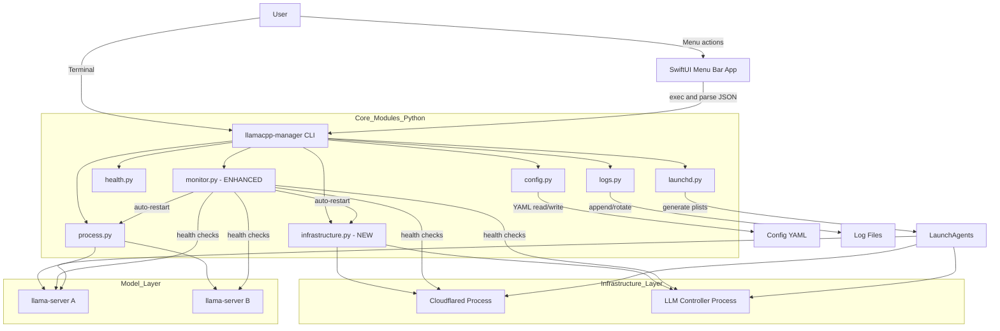
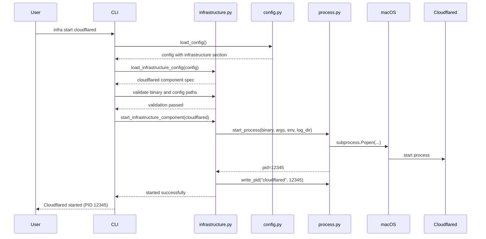
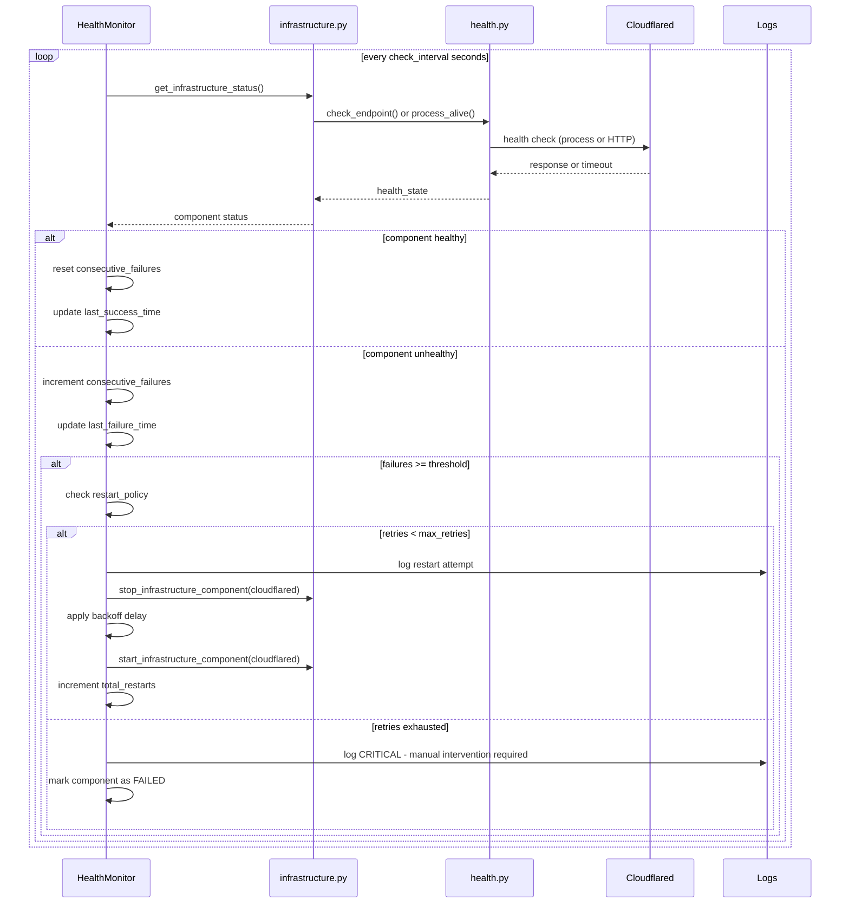

# File: /Users/liborballaty/LocalProjects/GitHubProjectsDocuments/llamaCPPManager/docs/design-infrastructure-management.md
# Description: Design document for cloudflared tunnel and LLM controller infrastructure management
# Author: Libor Ballaty <libor@arionetworks.com>
# Created: 2025-10-01

# Infrastructure Management Design

## 1. Overview
This document details the design for extending llamaCPPManager to manage infrastructure components (cloudflared tunnel and LLM controller) alongside LLM models, providing unified monitoring, health checking, process supervision, and automatic recovery.

## 2. Architecture

### 2.1 Enhanced System Architecture



**Key Additions**:
- **infrastructure.py**: New module for infrastructure-specific operations
- **monitor.py**: Enhanced module for health monitoring and auto-recovery
- **Infrastructure Layer**: Parallel to Model Layer, managed through same interfaces
- **Unified Health Monitoring**: Single monitoring daemon checks both infrastructure and models

---

### 2.2 Configuration Schema Extension

The existing `config.yaml` will be extended with an `infrastructure` section:

```yaml
# Existing configuration
llama_server_path: /opt/homebrew/bin/llama-server
log_dir: ~/Library/Logs/llamaCPPManager
timeout_ms: 2000

models:
  - name: smollm3
    model_path: ~/llms/smollm3/SmolLM3-Q8_0.gguf
    host: 127.0.0.1
    port: 8081
    args: ["-c", "8192", "-ngl", "9999"]
    autostart: true

# NEW: Infrastructure section
infrastructure:
  cloudflared:
    enabled: true
    type: tunnel
    binary_path: /opt/homebrew/bin/cloudflared
    config_path: ~/.cloudflared/config.yml
    working_dir: ~/.cloudflared
    args: ["tunnel", "run", "llamacpp-tunnel"]
    env: {}
    autostart: true
    health_check:
      type: process
      interval_seconds: 30
      timeout_ms: 5000
    restart_policy:
      enabled: true
      max_retries: 3
      backoff_seconds: 10
      backoff_multiplier: 2.0
      health_check_failures_threshold: 3

  llm_controller:
    enabled: true
    type: http_service
    binary_path: ~/llms/bin/llm-controller
    config_path: ~/llms/config/controller.yml
    working_dir: ~/llms
    args: ["--config", "controller.yml"]
    env:
      PORT: "8080"
      LOG_LEVEL: "info"
    autostart: true
    health_check:
      type: http
      endpoint: http://localhost:8080/health
      interval_seconds: 30
      timeout_ms: 5000
      expected_status: 200
    restart_policy:
      enabled: true
      max_retries: 3
      backoff_seconds: 10
      backoff_multiplier: 2.0
      health_check_failures_threshold: 3

# Global monitoring settings
monitoring:
  enabled: true
  interval_seconds: 30
  alert_on_failure: true
```

**Schema Design Rationale**:
- **Parallel Structure**: Infrastructure components mirror model configuration patterns for consistency
- **Type Field**: Distinguishes between tunnel services and HTTP services for appropriate health checking
- **Granular Control**: Per-component enable/disable, autostart, and restart policies
- **Flexibility**: Supports arbitrary args and environment variables
- **Monitoring Config**: Global monitoring settings apply to all components

---

### 2.3 Module Design

#### 2.3.1 infrastructure.py (NEW)

```python
# File: src/llamacpp_manager/infrastructure.py
# Description: Infrastructure component management for cloudflared and controller
# Author: Libor Ballaty <libor@arionetworks.com>
# Created: 2025-10-01

"""
Infrastructure component lifecycle management.

Business Purpose: Manages critical infrastructure components (cloudflared tunnel
and LLM controller) alongside model services, providing unified process control,
health monitoring, and automatic recovery.
"""

from dataclasses import dataclass
from typing import Dict, List, Optional, Any
from pathlib import Path


@dataclass
class InfrastructureComponent:
    """
    Represents a single infrastructure component configuration.

    Business Purpose: Encapsulates all settings needed to start, monitor,
    and manage an infrastructure service like cloudflared or the controller.
    """
    name: str
    enabled: bool
    type: str  # "tunnel" or "http_service"
    binary_path: str
    config_path: Optional[str]
    working_dir: str
    args: List[str]
    env: Dict[str, str]
    autostart: bool
    health_check: Dict[str, Any]
    restart_policy: Dict[str, Any]


def load_infrastructure_config(config: Dict[str, Any]) -> Dict[str, InfrastructureComponent]:
    """
    Load infrastructure components from config.

    Business Purpose: Parses configuration and returns validated infrastructure
    component definitions that can be managed by the system.

    Args:
        config: Full configuration dictionary with infrastructure section

    Returns:
        Dictionary mapping component name to InfrastructureComponent

    Example:
        config = load_config()
        components = load_infrastructure_config(config)
        cloudflared = components.get("cloudflared")
    """
    pass


def start_infrastructure_component(component: InfrastructureComponent, log_dir: Path) -> int:
    """
    Start an infrastructure component process.

    Business Purpose: Launches infrastructure service with proper logging,
    process tracking, and environment setup.

    Args:
        component: Component configuration
        log_dir: Directory for log files

    Returns:
        Process ID of started component

    Example:
        pid = start_infrastructure_component(cloudflared_config, Path("~/logs"))
    """
    pass


def stop_infrastructure_component(name: str, timeout: int = 10) -> bool:
    """
    Stop an infrastructure component process.

    Business Purpose: Gracefully terminates infrastructure service with
    proper cleanup and timeout handling.

    Args:
        name: Component name
        timeout: Seconds to wait before SIGKILL

    Returns:
        True if stopped successfully

    Example:
        success = stop_infrastructure_component("cloudflared", timeout=15)
    """
    pass


def get_infrastructure_status(components: Dict[str, InfrastructureComponent]) -> List[Dict[str, Any]]:
    """
    Get status of all infrastructure components.

    Business Purpose: Provides real-time visibility into infrastructure
    health for operators to assess system state quickly.

    Args:
        components: Dictionary of infrastructure components

    Returns:
        List of status dictionaries with pid, uptime, health state

    Example:
        status = get_infrastructure_status(components)
        # [{"name": "cloudflared", "pid": 12345, "state": "running", ...}]
    """
    pass
```

---

#### 2.3.2 monitor.py (ENHANCED)

```python
# File: src/llamacpp_manager/monitor.py
# Description: Unified health monitoring and auto-recovery for infrastructure and models
# Author: Libor Ballaty <libor@arionetworks.com>
# Created: 2025-10-01

"""
Continuous health monitoring and automatic recovery daemon.

Business Purpose: Ensures high availability by detecting failures and
automatically restarting failed components according to configured policies.
"""

from dataclasses import dataclass
from typing import Dict, List, Optional, Any
import time
import threading


@dataclass
class MonitoringState:
    """
    Tracks health state and restart history for a component.

    Business Purpose: Maintains failure counters, restart attempts, and
    backoff state to implement intelligent recovery policies.
    """
    component_name: str
    component_type: str  # "infrastructure" or "model"
    consecutive_failures: int
    total_restarts: int
    last_success_time: float
    last_failure_time: float
    backoff_seconds: int
    restart_in_progress: bool


class HealthMonitor:
    """
    Daemon that continuously monitors component health and triggers recovery.

    Business Purpose: Provides automated failure detection and recovery to
    minimize downtime and operator intervention.
    """

    def __init__(self, config: Dict[str, Any], check_interval: int = 30):
        """
        Initialize health monitor.

        Args:
            config: Full system configuration
            check_interval: Seconds between health checks
        """
        self.config = config
        self.check_interval = check_interval
        self.monitoring_states: Dict[str, MonitoringState] = {}
        self.running = False
        self.thread: Optional[threading.Thread] = None

    def start_monitoring(self) -> None:
        """
        Start the monitoring daemon in background thread.

        Business Purpose: Initiates continuous monitoring so operators
        don't need to manually watch system health.

        Example:
            monitor = HealthMonitor(config)
            monitor.start_monitoring()
        """
        pass

    def stop_monitoring(self) -> None:
        """
        Stop the monitoring daemon gracefully.

        Business Purpose: Clean shutdown of monitoring when system stops.

        Example:
            monitor.stop_monitoring()
        """
        pass

    def check_component_health(self, component_name: str, component_type: str) -> bool:
        """
        Check health of a single component.

        Business Purpose: Determines if component is healthy by running
        appropriate health check (process check or HTTP check).

        Args:
            component_name: Name of component
            component_type: "infrastructure" or "model"

        Returns:
            True if component is healthy

        Example:
            healthy = monitor.check_component_health("cloudflared", "infrastructure")
        """
        pass

    def handle_component_failure(self, component_name: str, component_type: str) -> None:
        """
        Handle component failure by attempting restart per policy.

        Business Purpose: Implements automatic recovery by restarting
        failed components according to configured retry and backoff policies.

        Args:
            component_name: Name of failed component
            component_type: "infrastructure" or "model"

        Example:
            monitor.handle_component_failure("cloudflared", "infrastructure")
        """
        pass

    def get_monitoring_report(self) -> Dict[str, Any]:
        """
        Get current monitoring state for all components.

        Business Purpose: Provides visibility into monitoring health,
        restart counts, and failure patterns for troubleshooting.

        Returns:
            Dictionary with monitoring statistics

        Example:
            report = monitor.get_monitoring_report()
            print(f"Total restarts: {report['total_restarts']}")
        """
        pass
```

---

#### 2.3.3 CLI Extension (cli.py)

New command group: `infra`

```bash
# Infrastructure commands
llamacpp-manager infra list                    # List infrastructure components
llamacpp-manager infra list --json             # JSON output
llamacpp-manager infra start cloudflared       # Start component
llamacpp-manager infra start all               # Start all enabled components
llamacpp-manager infra stop cloudflared        # Stop component
llamacpp-manager infra stop all                # Stop all components
llamacpp-manager infra restart cloudflared     # Restart component
llamacpp-manager infra status                  # Infrastructure status
llamacpp-manager infra status --json           # JSON output
llamacpp-manager infra logs cloudflared        # View logs
llamacpp-manager infra logs cloudflared --tail # Tail logs
llamacpp-manager infra config validate         # Validate configs
llamacpp-manager infra config show cloudflared # Show config
llamacpp-manager infra config edit cloudflared # Edit config
llamacpp-manager infra ensure-running          # Start down components

# Enhanced existing commands
llamacpp-manager status                        # Now includes infrastructure
llamacpp-manager status --json                 # Infrastructure in JSON
llamacpp-manager logs --all                    # All logs (infra + models)

# Launchd commands
llamacpp-manager launchd install cloudflared   # Install launchd agent
llamacpp-manager launchd install --all-infra   # All infrastructure
llamacpp-manager launchd uninstall cloudflared # Uninstall agent

# Startup automation
llamacpp-manager install-startup               # Install all autostart components
llamacpp-manager uninstall-startup             # Remove all launchd agents
llamacpp-manager startup status                # Show autostart config

# Monitoring commands
llamacpp-manager monitor start                 # Start monitoring daemon
llamacpp-manager monitor stop                  # Stop monitoring daemon
llamacpp-manager monitor status                # Show monitoring stats
llamacpp-manager monitor report                # Detailed monitoring report
```

**CLI Design Rationale**:
- **Parallel Commands**: Infrastructure commands mirror model commands (`start`, `stop`, `restart`)
- **Unified Status**: Single `status` command shows complete system state
- **Component-Specific Operations**: Actions can target specific components or all
- **Consistency**: Follows existing patterns for discoverability

---

### 2.4 Process Management Flow

#### 2.4.1 Infrastructure Start Flow



**Key Points**:
- Reuses existing `process.py` for subprocess management
- Infrastructure components get separate PID files under `pids/infra/`
- Logs written to `logs/infra/<component>.{out,err}.log`
- Same safety checks as models (binary exists, port availability for HTTP services)

---

#### 2.4.2 Health Monitoring and Auto-Restart Flow



**Key Points**:
- Single monitoring daemon handles both infrastructure and models
- Different health check types (process, HTTP) based on component type
- Exponential backoff prevents restart storms
- Clear logging for troubleshooting restart attempts
- Operator alerts when automatic recovery fails

---

### 2.5 Data Structures

#### 2.5.1 Status JSON Format

Enhanced `status --json` output includes infrastructure:

```json
{
  "infrastructure": [
    {
      "name": "cloudflared",
      "type": "tunnel",
      "enabled": true,
      "state": "running",
      "pid": 12345,
      "uptime_seconds": 7850,
      "health": {
        "state": "ok",
        "last_check": "2025-10-01T10:30:00Z",
        "consecutive_failures": 0
      },
      "restart_count": 0,
      "log_files": {
        "stdout": "~/Library/Logs/llamaCPPManager/infra/cloudflared.out.log",
        "stderr": "~/Library/Logs/llamaCPPManager/infra/cloudflared.err.log"
      }
    },
    {
      "name": "llm_controller",
      "type": "http_service",
      "enabled": true,
      "state": "running",
      "pid": 12346,
      "uptime_seconds": 7840,
      "health": {
        "state": "ok",
        "last_check": "2025-10-01T10:30:00Z",
        "consecutive_failures": 0,
        "http_status": 200,
        "latency_ms": 15
      },
      "restart_count": 1,
      "log_files": {
        "stdout": "~/Library/Logs/llamaCPPManager/infra/llm_controller.out.log",
        "stderr": "~/Library/Logs/llamaCPPManager/infra/llm_controller.err.log"
      }
    }
  ],
  "models": [
    {
      "name": "smollm3",
      "state": "running",
      "pid": 12350,
      "host": "127.0.0.1",
      "port": 8081,
      "uptime_seconds": 7800,
      "health": {
        "state": "ok",
        "latency_ms": 23,
        "http_status": 200,
        "version": "llama.cpp"
      },
      "mode": "launchd",
      "log_path": "~/Library/Logs/llamaCPPManager/models/smollm3.out.log"
    }
  ],
  "monitoring": {
    "enabled": true,
    "interval_seconds": 30,
    "last_check": "2025-10-01T10:30:00Z",
    "total_restarts": 1
  }
}
```

---

### 2.6 Launchd Integration

#### 2.6.1 Infrastructure Launchd Plist Template

```xml
<?xml version="1.0" encoding="UTF-8"?>
<!DOCTYPE plist PUBLIC "-//Apple//DTD PLIST 1.0//EN" "http://www.apple.com/DTDs/PropertyList-1.0.dtd">
<plist version="1.0">
<dict>
    <key>Label</key>
    <string>ai.llamacpp.infra.{{component_name}}</string>

    <key>ProgramArguments</key>
    <array>
        <string>{{binary_path}}</string>
        {{#args}}
        <string>{{.}}</string>
        {{/args}}
    </array>

    <key>WorkingDirectory</key>
    <string>{{working_dir}}</string>

    {{#env}}
    <key>EnvironmentVariables</key>
    <dict>
        {{#each env}}
        <key>{{@key}}</key>
        <string>{{this}}</string>
        {{/each}}
    </dict>
    {{/env}}

    <key>KeepAlive</key>
    <true/>

    <key>RunAtLoad</key>
    <true/>

    <key>StandardOutPath</key>
    <string>{{log_dir}}/infra/{{component_name}}.out.log</string>

    <key>StandardErrorPath</key>
    <string>{{log_dir}}/infra/{{component_name}}.err.log</string>

    <key>ThrottleInterval</key>
    <integer>10</integer>
</dict>
</plist>
```

**Design Notes**:
- Label format: `ai.llamacpp.infra.<component_name>`
- Separate from model plists: `ai.llamacpp.<model_name>`
- KeepAlive ensures automatic restart by launchd
- RunAtLoad starts on boot
- ThrottleInterval prevents restart storms (10 seconds minimum between restarts)

---

#### 2.6.2 Startup Dependency Ordering

When installing startup agents, order matters:

```
1. Infrastructure components (cloudflared, controller)
2. Model services (depends on controller being ready)
3. GUI app (optional, for menu bar visibility)
```

Implementation approach:
- Use launchd `StartInterval` with staggered delays
- Or: Use single master launcher script that orchestrates startup
- Or: Let each component's health check handle wait-for-dependencies

**Recommended**: Staggered launchd agents with health checks
- Cloudflared: Starts immediately (RunAtLoad)
- Controller: Starts 5 seconds after (StartInterval=5)
- Models: Start 10 seconds after (StartInterval=10)
- Health monitoring handles transient failures during startup

---

### 2.7 GUI Integration

**Design Principle**: Maintain all current functionality and GUI layout, extending it non-invasively for infrastructure management.

#### 2.7.1 Menu Bar Icon Status Indicator

The brain icon in the menu bar provides at-a-glance system health:

**Icon States**:
- 🟢 **Green (Solid)**: All systems healthy (infrastructure + models)
- 🟡 **Yellow (Solid)**: Warning - some health checks failing but components running
- 🔴 **Red (Blinking)**: Critical - one or more components down or restart failed
- ⚪ **Gray (Solid)**: All components stopped (normal idle state)

**Blinking Animation**:
- Red blink pattern: 500ms on, 500ms off (1Hz) when problems detected
- Stops blinking when user opens menu (acknowledges alert)
- Resumes blinking if problem persists after menu closes

**Icon State Logic**:
```swift
enum SystemHealthState {
    case healthy          // All components up and healthy → Green
    case warning          // Some health check failures → Yellow
    case critical         // Component down or restart failed → Red (blinking)
    case idle            // All stopped intentionally → Gray
}

func determineSystemHealth() -> SystemHealthState {
    let infraComponents = getInfrastructureStatus()
    let models = getModelStatus()

    // Critical: Any component down unexpectedly
    if infraComponents.contains(where: { $0.state == "down" && $0.enabled }) ||
       models.contains(where: { $0.state == "down" && $0.autostart }) {
        return .critical
    }

    // Warning: Health checks failing but processes running
    if infraComponents.contains(where: { $0.health.consecutive_failures > 0 }) ||
       models.contains(where: { $0.health.consecutive_failures > 0 }) {
        return .warning
    }

    // Idle: Nothing running
    if infraComponents.allSatisfy({ !$0.isRunning }) &&
       models.allSatisfy({ !$0.isRunning }) {
        return .idle
    }

    // Healthy: Everything expected is running and healthy
    return .healthy
}
```

#### 2.7.2 Enhanced Menu Bar Layout

```
┌─────────────────────────────────────────────┐
│ 🧠 llamaCPP Manager                          │  ← Icon color indicates health
├─────────────────────────────────────────────┤
│ Infrastructure                               │
│   ✓ Cloudflared         [Running] 2h15m     │
│     ├── Start                               │
│     ├── Stop                                │
│     ├── Restart                             │
│     └── View Logs                           │
│   ✓ LLM Controller      [Running] 2h14m     │
│     ├── Start                               │
│     ├── Stop                                │
│     ├── Restart                             │
│     └── View Logs                           │
├─────────────────────────────────────────────┤
│ Models                                       │  ← Existing models section unchanged
│   ✓ smollm3            [Running] port 8081  │
│   ○ llama2             [Stopped]            │
├─────────────────────────────────────────────┤
│ Start All Infrastructure                     │
│ Stop All Infrastructure                      │
│ Start All Models                             │  ← Existing controls preserved
│ Stop All Models                              │
├─────────────────────────────────────────────┤
│ Monitoring: Active (checks every 30s)       │  ← New monitoring status
│ Last Check: 5 seconds ago                    │
│ Restarts today: 0                            │
├─────────────────────────────────────────────┤
│ Refresh Status                               │  ← Existing actions preserved
│ Preferences...                               │
│ Quit                                         │
└─────────────────────────────────────────────┘
```

**Component Status Indicators**:
- ✓ Green: Running and healthy
- ⚠ Yellow: Running but health check failing
- ○ Gray: Stopped
- ⚡ Orange: Restarting
- ✗ Red: Failed (exhausted retries)

**Layout Principles**:
- Infrastructure section added above models (logically it's the foundation)
- All existing model controls and menus preserved
- New "Monitoring" status section provides visibility into auto-recovery
- Existing preferences and quit actions remain at bottom

---

#### 2.7.3 SwiftUI Implementation Approach

**Backward Compatibility**: All existing SwiftUI components and functionality remain unchanged. New infrastructure features are additive only.

Extend existing SwiftUI app with:

1. **New Model**: `InfrastructureComponent` Swift struct
2. **Enhanced ViewModel**: Parse infrastructure from JSON status, add system health calculation
3. **New View**: `InfrastructureMenuSection` component
4. **Enhanced Icon**: `MenuBarIconManager` to handle color changes and blinking
5. **Reuse Logic**: Use existing CLI exec and JSON parsing infrastructure

**Menu Bar Icon Manager**:
```swift
// File: gui-macos/Sources/Views/MenuBarIconManager.swift
// Description: Manages menu bar icon color and blinking animation based on system health
// Author: Libor Ballaty <libor@arionetworks.com>
// Created: 2025-10-01

import SwiftUI
import AppKit

class MenuBarIconManager: ObservableObject {
    @Published var currentState: SystemHealthState = .idle
    private var blinkTimer: Timer?
    private var isBlinkVisible = true
    private var statusBarButton: NSStatusBarButton?

    enum SystemHealthState {
        case healthy
        case warning
        case critical
        case idle

        var color: NSColor {
            switch self {
            case .healthy: return .systemGreen
            case .warning: return .systemYellow
            case .critical: return .systemRed
            case .idle: return .systemGray
            }
        }

        var requiresBlinking: Bool {
            return self == .critical
        }
    }

    func updateState(_ newState: SystemHealthState) {
        guard currentState != newState else { return }
        currentState = newState

        if newState.requiresBlinking {
            startBlinking()
        } else {
            stopBlinking()
            updateIcon(visible: true)
        }
    }

    private func startBlinking() {
        stopBlinking()  // Clear any existing timer
        blinkTimer = Timer.scheduledTimer(withTimeInterval: 0.5, repeats: true) { [weak self] _ in
            self?.isBlinkVisible.toggle()
            self?.updateIcon(visible: self?.isBlinkVisible ?? true)
        }
    }

    private func stopBlinking() {
        blinkTimer?.invalidate()
        blinkTimer = nil
        isBlinkVisible = true
    }

    private func updateIcon(visible: Bool) {
        guard let button = statusBarButton else { return }
        // Update icon with color and visibility
        // Implementation will render brain icon with currentState.color
        // When visible=false during blink, render transparent or dimmed
    }

    func acknowledgeAlert() {
        // User opened menu, stop blinking temporarily
        if currentState == .critical {
            stopBlinking()
        }
    }

    func resumeAlertIfNeeded() {
        // User closed menu, resume blinking if still critical
        if currentState == .critical {
            startBlinking()
        }
    }
}
```

**Infrastructure Component Model**:
```swift
// File: gui-macos/Sources/Models/InfrastructureComponent.swift
// Description: Infrastructure component model for SwiftUI
// Author: Libor Ballaty <libor@arionetworks.com>
// Created: 2025-10-01

import Foundation

struct InfrastructureComponent: Identifiable, Codable {
    let id = UUID()
    let name: String
    let type: String
    let enabled: Bool
    let state: String
    let pid: Int?
    let uptime_seconds: Int?
    let health: HealthState
    let restart_count: Int
    let log_files: LogFiles

    struct HealthState: Codable {
        let state: String
        let last_check: String
        let consecutive_failures: Int
        let http_status: Int?
        let latency_ms: Int?
    }

    struct LogFiles: Codable {
        let stdout: String
        let stderr: String
    }

    var isRunning: Bool {
        state == "running"
    }

    var isHealthy: Bool {
        health.state == "ok"
    }

    var uptimeFormatted: String {
        guard let uptime = uptime_seconds else { return "N/A" }
        let hours = uptime / 3600
        let minutes = (uptime % 3600) / 60
        return "\(hours)h\(minutes)m"
    }
}
```

---

### 2.8 Security Considerations

#### 2.8.1 Binary Path Validation
- Validate binary paths exist and are executable before starting
- Reject relative paths or paths outside standard directories
- Check binary signatures on macOS (future enhancement)

#### 2.8.2 Config File Permissions
- Verify config files are owned by current user
- Warn if config files are world-readable
- Cloudflared credentials should have 0600 permissions

#### 2.8.3 Process Isolation
- Infrastructure processes run as current user (not root)
- Environment variables sanitized before passing to subprocess
- No shell interpolation in arguments

---

### 2.9 Error Handling

#### 2.9.1 Startup Errors
- **Binary Not Found**: Clear error message with installation instructions
- **Config Invalid**: Detailed validation errors with file location
- **Port Conflict**: Show conflicting process and suggest alternative
- **Permission Denied**: Suggest fixing permissions or running with correct user

#### 2.9.2 Runtime Errors
- **Health Check Timeout**: Log warning, retry with backoff
- **Restart Failed**: Alert operator after max retries exhausted
- **Process Crash**: Capture exit code and stderr for diagnosis
- **Config Change During Run**: Detect and prompt for restart

---

### 2.10 Testing Strategy

#### 2.10.1 Unit Tests
- `test_infrastructure.py`: Component loading, validation, start/stop
- `test_monitor.py`: Health checking, restart logic, backoff calculation
- Mock infrastructure binaries with test scripts

#### 2.10.2 Integration Tests
- `test_infrastructure_lifecycle.py`: Full start/stop/restart cycle
- `test_health_monitoring.py`: Monitor detects and restarts failed components
- `test_launchd_infrastructure.py`: Launchd plist generation and loading

#### 2.10.3 GUI Tests
- `InfrastructureUITests.swift`: Menu rendering, status updates
- `InfrastructureInteractionTests.swift`: Start/stop/restart actions

---

### 2.11 Implementation Phases

#### Phase 1: Core Infrastructure Management (Week 1)
- [ ] Add `infrastructure` section to config schema
- [ ] Implement `infrastructure.py` module
- [ ] Add `infra` CLI command group
- [ ] Infrastructure start/stop/restart functionality
- [ ] PID tracking and log management
- [ ] Unit tests for core functionality
- **Commit**: "feat: add infrastructure component management"

#### Phase 2: Health Monitoring and Recovery (Week 1)
- [ ] Implement `monitor.py` enhanced monitoring
- [ ] Process health checks
- [ ] HTTP health checks
- [ ] Automatic restart with backoff
- [ ] Integration tests for monitoring
- **Commit**: "feat: add health monitoring and auto-recovery"

#### Phase 3: Status Integration (Week 1)
- [ ] Extend `status` command to include infrastructure
- [ ] JSON output with infrastructure section
- [ ] Integration tests for status
- **Commit**: "feat: integrate infrastructure into status command"

#### Phase 4: Launchd and Startup (Week 2)
- [ ] Infrastructure launchd plist generation
- [ ] `install-startup` / `uninstall-startup` commands
- [ ] Startup dependency ordering
- [ ] Integration tests for launchd
- **Commit**: "feat: add launchd and startup automation for infrastructure"

#### Phase 5: GUI Integration (Week 2)
- [ ] Swift models for infrastructure
- [ ] Infrastructure menu section
- [ ] Start/stop/restart controls
- [ ] Log viewer integration
- [ ] GUI tests
- **Commit**: "feat: add infrastructure support to GUI"

#### Phase 6: Polish and Documentation (Week 2)
- [ ] Error handling improvements
- [ ] Alert notifications (macOS User Notifications)
- [ ] Update user manual
- [ ] End-to-end testing
- **Commit**: "docs: complete infrastructure management documentation"

---

### 2.12 Open Design Decisions

#### Decision 1: Monitoring Daemon vs. Launchd KeepAlive
**Option A**: Built-in monitoring daemon in Python
- Pros: Fine-grained control, custom restart policies, cross-component logic
- Cons: Additional process, needs its own supervision

**Option B**: Rely on launchd KeepAlive
- Pros: Native macOS supervision, no additional process
- Cons: Less control over restart policies, harder to coordinate dependencies

**Recommendation**: Option A with launchd fallback
- Use monitoring daemon when running in direct mode
- Use launchd KeepAlive when running in launchd mode
- Provides flexibility for different deployment scenarios

#### Decision 2: Configuration Discovery
**Option A**: Auto-detect cloudflared config
- Pros: Less configuration required
- Cons: May detect wrong config, less explicit

**Option B**: Require explicit config paths
- Pros: Clear, explicit, no surprises
- Cons: More configuration required

**Recommendation**: Option B with sensible defaults
- Default paths: `~/.cloudflared/config.yml`, `~/llms/config/controller.yml`
- Validate paths exist on `infra add` or `init`
- Provide clear error messages if not found

#### Decision 3: Health Check Endpoint for Cloudflared
**Option A**: Process-only health check
- Pros: Simple, no HTTP dependency
- Cons: Doesn't verify tunnel is actually working

**Option B**: HTTP check via metrics endpoint
- Pros: Verifies tunnel connectivity
- Cons: Requires cloudflared metrics enabled

**Recommendation**: Option A for MVP, Option B for future
- Start with process-only check (verify PID exists and responsive)
- Add optional metrics endpoint check in future release

---

### 2.13 Migration Path

For existing llamaCPPManager users:

1. **Config Migration**: Automatically add empty `infrastructure` section on first run
2. **Backward Compatibility**: All existing commands continue to work unchanged
3. **Opt-In**: Infrastructure management is opt-in via `infra add` commands
4. **Documentation**: Provide migration guide in user manual

---

## 3. Summary

This design extends llamaCPPManager with infrastructure component management through:

1. **Parallel Architecture**: Infrastructure components managed alongside models
2. **Unified Monitoring**: Single health monitoring daemon for all components
3. **Consistent Interface**: Same CLI patterns and GUI for infrastructure and models
4. **Automatic Recovery**: Intelligent restart policies with exponential backoff
5. **Launchd Integration**: Native macOS supervision and boot startup
6. **Operator Visibility**: Clear status, logs, and alerts

The design reuses existing modules (process.py, health.py, launchd.py) and extends them for infrastructure, minimizing code duplication and maintaining consistency.

---

**Next Steps**:
1. Review design with user
2. Get approval on open design decisions
3. Begin Phase 1 implementation
4. Commit incrementally with regression testing

---

_Questions or feedback: libor@arionetworks.com_
