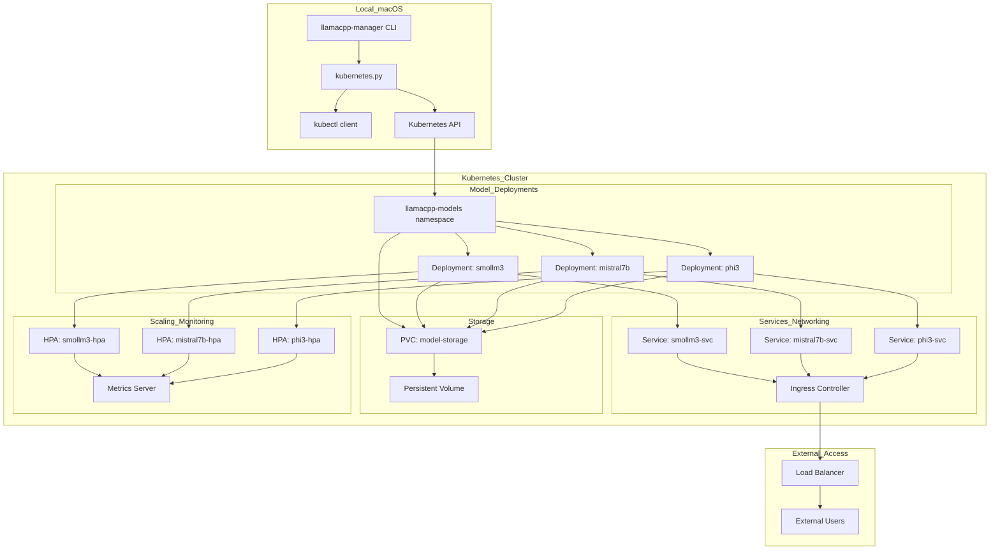
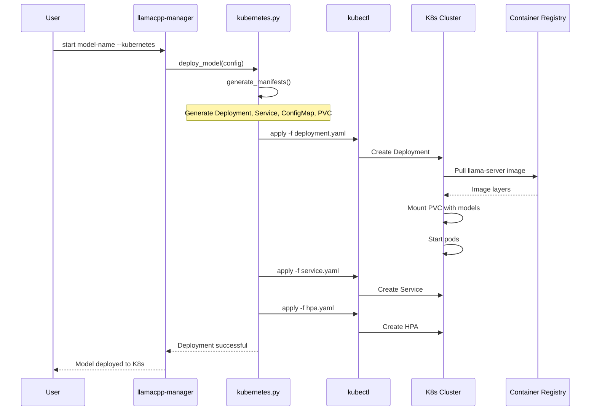

# llamaCPPManager — Kubernetes Design

## Overview
Kubernetes deployment strategy for llamaCPPManager, enabling scalable, cloud-native deployments of llama.cpp models with advanced orchestration capabilities.

## Kubernetes Architecture



## Deployment Flow



## Manifest Templates

### Deployment Template
```yaml
apiVersion: apps/v1
kind: Deployment
metadata:
  name: {model_name}
  namespace: llamacpp-models
  labels:
    app: llamacpp-server
    model: {model_name}
    managed-by: llamacpp-manager
spec:
  replicas: {initial_replicas}
  selector:
    matchLabels:
      app: llamacpp-server
      model: {model_name}
  template:
    metadata:
      labels:
        app: llamacpp-server
        model: {model_name}
    spec:
      containers:
      - name: llama-server
        image: {registry}/llama-server:{tag}
        ports:
        - containerPort: 8080
          name: http
        env:
        - name: MODEL_PATH
          value: "/models/{model_file}"
        - name: PORT
          value: "8080"
        resources:
          requests:
            memory: {memory_request}
            cpu: {cpu_request}
          limits:
            memory: {memory_limit}
            cpu: {cpu_limit}
        volumeMounts:
        - name: model-storage
          mountPath: /models
          readOnly: true
        - name: config
          mountPath: /config
        livenessProbe:
          httpGet:
            path: /health
            port: 8080
          initialDelaySeconds: 30
          periodSeconds: 10
        readinessProbe:
          httpGet:
            path: /v1/models
            port: 8080
          initialDelaySeconds: 15
          periodSeconds: 5
      volumes:
      - name: model-storage
        persistentVolumeClaim:
          claimName: model-storage
      - name: config
        configMap:
          name: {model_name}-config
```

### Service Template
```yaml
apiVersion: v1
kind: Service
metadata:
  name: {model_name}-svc
  namespace: llamacpp-models
  labels:
    app: llamacpp-server
    model: {model_name}
spec:
  selector:
    app: llamacpp-server
    model: {model_name}
  ports:
  - port: 80
    targetPort: 8080
    protocol: TCP
    name: http
  type: ClusterIP
```

### HPA Template
```yaml
apiVersion: autoscaling/v2
kind: HorizontalPodAutoscaler
metadata:
  name: {model_name}-hpa
  namespace: llamacpp-models
spec:
  scaleTargetRef:
    apiVersion: apps/v1
    kind: Deployment
    name: {model_name}
  minReplicas: {min_replicas}
  maxReplicas: {max_replicas}
  metrics:
  - type: Resource
    resource:
      name: cpu
      target:
        type: Utilization
        averageUtilization: 70
  - type: Resource
    resource:
      name: memory
      target:
        type: Utilization
        averageUtilization: 80
```

## Configuration Schema Extensions

```yaml
models:
  - name: smollm3
    model_path: /Users/you/llms/smollm3/SmolLM3-Q8_0.gguf
    deployment_mode: kubernetes  # bare-metal | container | kubernetes
    kubernetes:
      namespace: llamacpp-models
      replicas:
        initial: 1
        min: 1
        max: 5
      resources:
        requests:
          memory: "2Gi"
          cpu: "500m"
        limits:
          memory: "4Gi"
          cpu: "2"
      storage:
        pvc_name: model-storage
        mount_path: /models
      image:
        registry: "localhost:5000"
        repository: "llama-server"
        tag: "latest"
      context: "local-cluster"  # kubectl context
      ingress:
        enabled: true
        host: "smollm3.local.dev"
        tls: false
```

## CLI Command Extensions

```bash
# Deploy to Kubernetes
llamacpp-manager start smollm3 --kubernetes

# Scale deployment
llamacpp-manager k8s scale smollm3 --replicas 3

# Show K8s-specific status
llamacpp-manager status --kubernetes
llamacpp-manager k8s status smollm3

# Get logs from K8s pods
llamacpp-manager k8s logs smollm3 --follow

# Build and push container image
llamacpp-manager k8s build smollm3 --push

# Deploy with custom context
llamacpp-manager start smollm3 --kubernetes --context production-cluster

# Generate manifests without applying
llamacpp-manager k8s manifest smollm3 --output ./manifests/

# Clean up K8s resources
llamacpp-manager k8s cleanup smollm3
```

## Status Integration

Enhanced status output for Kubernetes deployments:

```json
{
  "models": [
    {
      "name": "smollm3",
      "deployment_mode": "kubernetes",
      "status": "running",
      "kubernetes": {
        "namespace": "llamacpp-models",
        "context": "local-cluster",
        "replicas": {
          "desired": 2,
          "ready": 2,
          "available": 2
        },
        "service": {
          "name": "smollm3-svc",
          "cluster_ip": "10.96.45.123",
          "port": 80
        },
        "pods": [
          {
            "name": "smollm3-7d4b8f5c6d-abc12",
            "status": "Running",
            "node": "worker-1",
            "ready": true
          },
          {
            "name": "smollm3-7d4b8f5c6d-def34",
            "status": "Running",
            "node": "worker-2",
            "ready": true
          }
        ],
        "hpa": {
          "enabled": true,
          "current_replicas": 2,
          "target_cpu": 70,
          "current_cpu": 45
        }
      },
      "health": {
        "reachable": true,
        "latency_ms": 23,
        "endpoint": "http://smollm3.local.dev/v1/models"
      }
    }
  ]
}
```

## Security Considerations

1. **RBAC**: Create service accounts with minimal permissions
2. **Network Policies**: Restrict pod-to-pod communication
3. **Secrets Management**: Store sensitive configs in K8s Secrets
4. **Image Security**: Use distroless base images and scan for vulnerabilities
5. **Resource Limits**: Prevent resource exhaustion attacks

## Multi-Cluster Support

- Support multiple kubectl contexts
- Cluster-specific configuration profiles
- Cross-cluster model federation for load distribution
- Disaster recovery with automatic failover

## Integration Points

- **GitOps**: Generate manifests compatible with ArgoCD/Flux
- **Monitoring**: Prometheus metrics and Grafana dashboards
- **Logging**: Structured logging with Fluentd/Fluent Bit
- **Service Mesh**: Istio integration for advanced traffic management