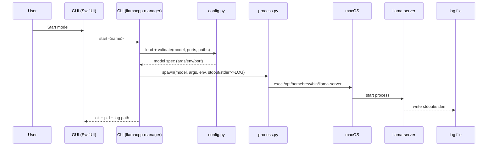
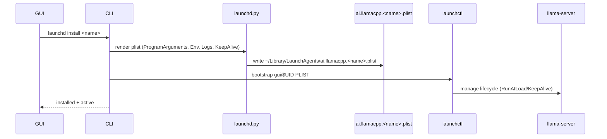
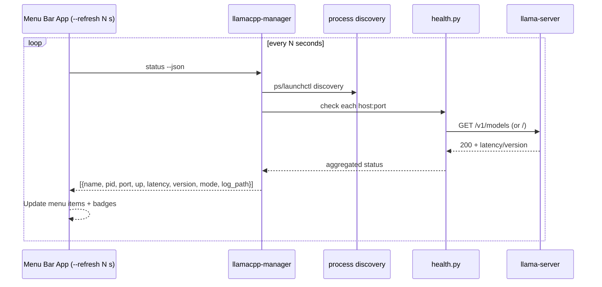

# llamaCPPManager — Design

## Overview
A macOS‑friendly toolkit to configure, launch, and monitor multiple llama.cpp `llama-server` instances with clear status, logs, optional autostart via launchd, and a native menu bar GUI.

## Architecture

```mermaid
graph TD
  U[User] -->|Menu actions| GUI[SwiftUI Menu Bar App]
  U -->|Terminal| CLI[llamacpp-manager (Python CLI)]

  subgraph Core Modules (Python)
    CLI --> CFG[config.py]
    CLI --> PROC[process.py]
    CLI --> H[health.py]
    CLI --> L[logs.py]
    CLI --> LD[launchd.py]
  end

  GUI -->|exec + parse JSON| CLI

  CFG -->|YAML read/write| Y[Config (~/Library/Application Support/llamaCPPManager/config.yaml)]
  L -->|append/rotate| LOGS[Log files (~/Library/Logs/llamaCPPManager/*.log)]

  PROC -->|spawn/terminate| OS[(macOS)]
  OS -->|exec| S1[llama-server A]
  OS -->|exec| S2[llama-server B]
  OS -->|exec| S3[llama-server C]

  LD -->|generate/load/unload| P1[launchd agents]
  P1 --> OS

  H -->|HTTP checks| S1
  H -->|HTTP checks| S2
  H -->|HTTP checks| S3
```

Communication paths:
- GUI → CLI: invoke subcommands, parse `--json` outputs
- CLI ↔ Config: YAML load/validate/write
- CLI → Process: subprocess spawn/terminate; optional `launchctl` for launchd mode
- Health → Server: HTTP on `host:port` (local by default)
- Logs: process stdout/stderr → rotating files

## Start/Stop Flow (Direct Mode)



## Autostart Flow (launchd Mode)



## Status/Health Poll



## Data Model (Config)

- Location: `~/Library/Application Support/llamaCPPManager/config.yaml`
- Schema (simplified):
  - `llama_server_path` (string; default `/opt/homebrew/bin/llama-server`)
  - `log_dir` (string; default `~/Library/Logs/llamaCPPManager`)
  - `timeout_ms` (int; default 2000)
  - `models[]`:
    - `name` (unique)
    - `model_path` (GGUF)
    - `host` (default `127.0.0.1`)
    - `port` (unique)
    - `args[]` (additional flags, e.g., `-c`, `8192`, `-ngl`, `9999`)
    - `env{}` (optional)
    - `autostart` (bool)

Example:
```yaml
llama_server_path: /opt/homebrew/bin/llama-server
log_dir: /Users/you/Library/Logs/llamaCPPManager
timeout_ms: 2000
models:
  - name: smollm3
    model_path: /Users/you/llms/smollm3/SmolLM3-Q8_0.gguf
    host: 127.0.0.1
    port: 8081
    args: ["-c","8192","-ngl","9999","-t","12","--parallel","4","--cont-batching"]
    env: {}
    autostart: true
```

## CLI Surface

- `init` – create config and dirs
- `config add|remove|update|list` – manage model entries with validation
- `start <name|all>` – direct or `--launchd`; `--dry-run`
- `stop <name|all>` – direct or `--launchd`
- `restart <name|all>`
- `status [--json] [--watch]`
- `logs <name|all> [--tail]`
- `launchd install|uninstall <name|all>`

## GUI (SwiftUI Menu Bar)

- Status list with per‑model indicators (up/down, latency, pid, port)
- Actions: Start, Stop, Restart, Tail Logs, Open Config, Refresh
- Preferences: `llama_server_path`, `log_dir`, refresh interval, launch at login
- Communication: run CLI with `Process`, parse JSON; no long‑lived daemon

## Logging

- Per‑model rotating logs in `log_dir` (e.g., 10MB × 5)
- CLI shortcuts:
  - `logs <name> --tail`
  - `logs --all --tail`

## Error Handling

- Missing `llama-server`, bad `model_path`, or busy `port` → clear messages + exit codes
- Graceful shutdown with timeout fallback

## Packaging

- Python package with console script `llamacpp-manager` (pipx‑friendly)
- GUI app in `gui-macos/` (SwiftUI, macOS 14+), distributed as `.app`
- Optional Automator app as interim launcher
