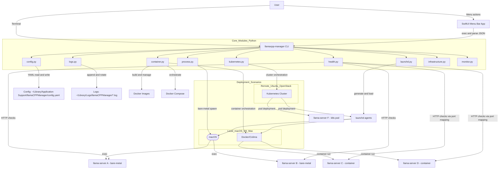
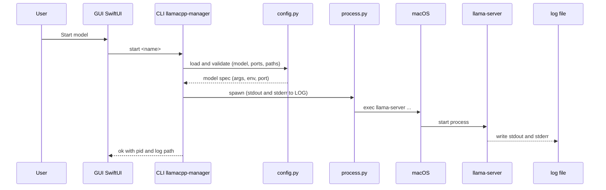
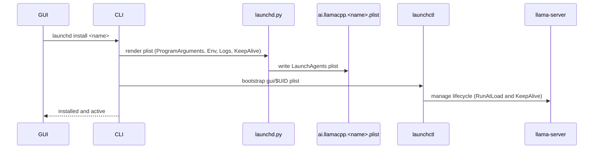
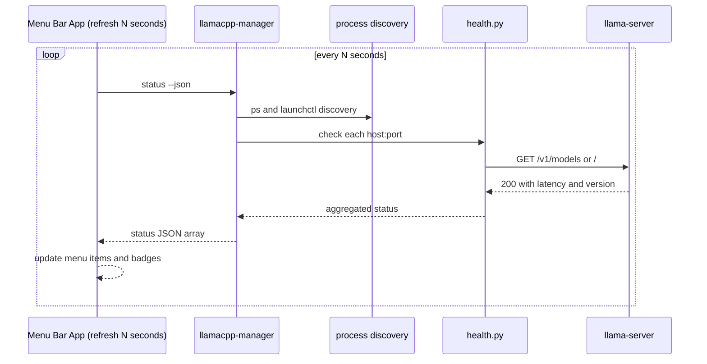
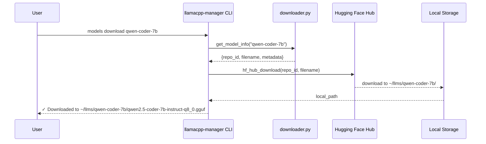
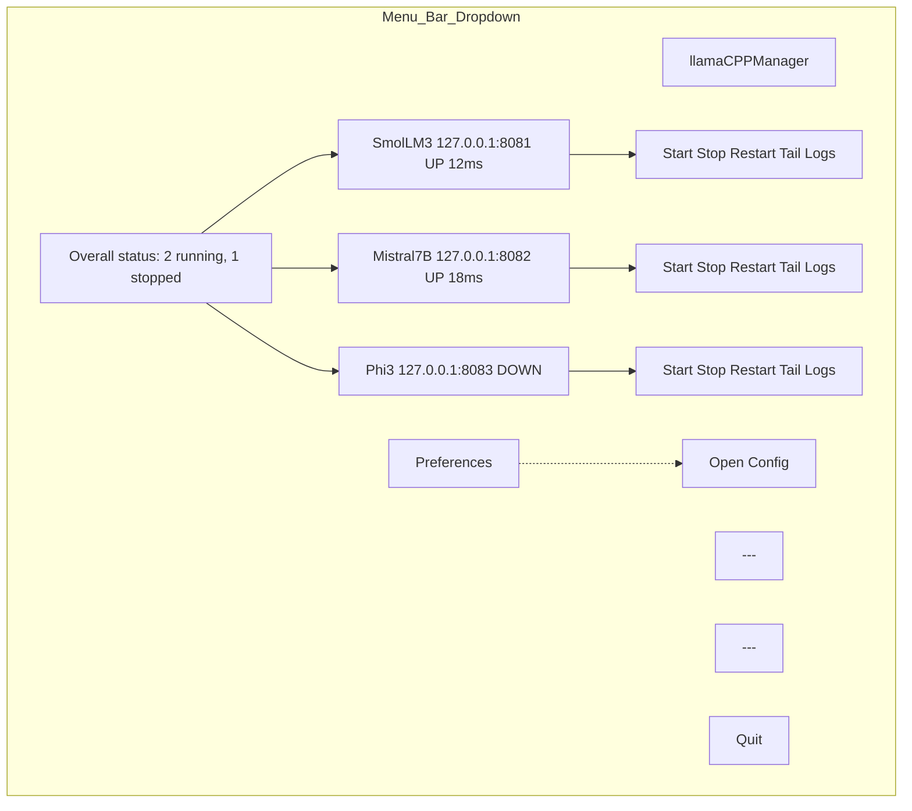
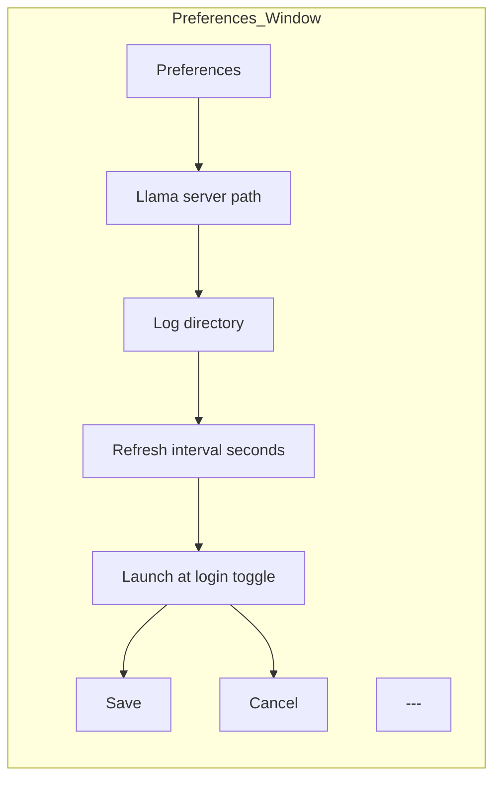

# llamaCPPManager — Design

## Overview
A macOS‑friendly toolkit to configure, launch, and monitor multiple llama.cpp `llama-server` instances and supporting infrastructure components. Supports **flexible deployment** with native (bare-metal) as default and optional containerized deployment. Provides unified model management with exclusive model groups for resource-constrained scenarios, health monitoring with auto-restart, infrastructure management, clear status, logs, optional autostart, MCP server integration, and native menu bar GUI.

## Deployment Philosophy
- **Native-first**: All models work without containers (direct `llama-server` processes)
- **Containers optional**: Enable container deployment per-model when isolation is needed
- **On-demand by default**: Models start when requested, not automatically
- **Flexible groups**: Define exclusive groups for large models that shouldn't run concurrently

## Architecture


```mermaid
graph TD
  U[User] -->|Menu actions| GUI[SwiftUI Menu Bar App]
  U -->|Terminal| CLI[llamacpp-manager CLI]

  subgraph Core_Modules_Python
    CLI --> CFG[config.py]
    CLI --> PROC[process.py]
    CLI --> H[health.py]
    CLI --> L[logs.py]
    CLI --> LD[launchd.py]
    CLI --> CONT[container.py]
    CLI --> K8S[kubernetes.py]
    CLI --> INFRA[infrastructure.py]
    CLI --> MON[monitor.py]
  end

  GUI -->|exec and parse JSON| CLI

  CFG -->|YAML read and write| Y[Config: ~/Library/Application Support/llamaCPPManager/config.yaml]
  L -->|append and rotate| LOGS[Logs: ~/Library/Logs/llamaCPPManager/*.log]

  subgraph Deployment_Scenarios
    subgraph Local_macOS_M4_Max
      PROC -->|bare-metal spawn| OS([macOS])
      CONT -->|container orchestration| DOCKER[Docker/Colima]
    end

    subgraph Remote_Ubuntu_OpenStack
      K8S -->|cluster orchestration| CLUSTER[Kubernetes Cluster]
    end
  end

  OS -->|exec| S1[llama-server A - bare-metal]
  OS -->|exec| S2[llama-server B - bare-metal]
  DOCKER -->|container run| C1[llama-server C - container]
  DOCKER -->|container run| C2[llama-server D - container]
  CLUSTER -->|pod deployment| P1[llama-server E - k8s pod]
  CLUSTER -->|pod deployment| P2[llama-server F - k8s pod]

  LD -->|generate and load| P1[launchd agents]
  P1 --> OS
  P1 --> DOCKER

  H -->|HTTP checks| S1
  H -->|HTTP checks| S2
  H -->|HTTP checks via port mapping| C1
  H -->|HTTP checks via port mapping| C2

  CONT -->|build and manage| IMG[Docker Images]
  CONT -->|orchestrate| COMPOSE[Docker Compose]
```

Communication paths:
- GUI → CLI: invoke subcommands, parse `--json` outputs
- CLI ↔ Config: YAML load/validate/write with deployment scenario selection
- **Local macOS M4 Max scenarios:**
  - CLI → Process: subprocess spawn/terminate; optional `launchctl` for launchd mode
  - CLI → Container: Docker API for container lifecycle management via Colima
- **Remote Ubuntu OpenStack scenario:**
  - CLI → Kubernetes: kubectl and K8s API for cluster deployments (see `docs/design-kubernetes.md`)
- Health → Server: HTTP checks adapted per scenario (local ports, container mappings, K8s service endpoints)
- Logs: scenario-appropriate log collection (process files, docker logs, kubectl logs)

## Start/Stop Flow (Direct Mode)


```mermaid
sequenceDiagram
  participant U as User
  participant GUI as GUI SwiftUI
  participant CLI as CLI llamacpp-manager
  participant CFG as config.py
  participant PROC as process.py
  participant OS as macOS
  participant S as llama-server
  participant LOG as log file

  U->>GUI: Start model
  GUI->>CLI: start <name>
  CLI->>CFG: load and validate (model, ports, paths)
  CFG-->>CLI: model spec (args, env, port)
  CLI->>PROC: spawn (stdout and stderr to LOG)
  PROC->>OS: exec llama-server ...
  OS->>S: start process
  S-->>LOG: write stdout and stderr
  CLI-->>GUI: ok with pid and log path
```

## Autostart Flow (launchd Mode)


```mermaid
sequenceDiagram
  participant GUI as GUI
  participant CLI as CLI
  participant LD as launchd.py
  participant PLIST as ai.llamacpp.<name>.plist
  participant LCTL as launchctl
  participant S as llama-server

  GUI->>CLI: launchd install <name>
  CLI->>LD: render plist (ProgramArguments, Env, Logs, KeepAlive)
  LD->>PLIST: write LaunchAgents plist
  CLI->>LCTL: bootstrap gui/$UID plist
  LCTL->>S: manage lifecycle (RunAtLoad and KeepAlive)
  CLI-->>GUI: installed and active
```

## Status/Health Poll


```mermaid
sequenceDiagram
  participant GUI as Menu Bar App (refresh N seconds)
  participant CLI as llamacpp-manager
  participant DISC as process discovery
  participant H as health.py
  participant S as llama-server

  loop every N seconds
    GUI->>CLI: status --json
    CLI->>DISC: ps and launchctl discovery
    CLI->>H: check each host:port
    H->>S: GET /v1/models or /
    S-->>H: 200 with latency and version
    H-->>CLI: aggregated status
    CLI-->>GUI: status JSON array
    GUI-->>GUI: update menu items and badges
  end
```

## Data Model (Config)

- Location: `~/Library/Application Support/llamaCPPManager/config.yaml`
- Schema (with unified deployment):
  - `llama_server_path` (string; default `/opt/homebrew/bin/llama-server`)
  - `log_dir` (string; default `~/Library/Logs/llamaCPPManager`)
  - `timeout_ms` (int; default 2000)
  - `model_groups{}` (optional; defines exclusive groups):
    - `exclusive` (bool; only one model in group at a time)
    - `auto_stop_minutes` (int; inactivity timeout)
    - `members[]` (list of model names)
  - `models[]`:
    - `name` (unique)
    - `model_path` (GGUF file path)
    - `deployment_type` (enum: `native` | `container`; default `native`)
    - `host` (default `127.0.0.1`)
    - `port` (unique)
    - `group` (optional; name of model group)
    - `args[]` (additional flags, e.g., `--ctx-size`, `32768`)
    - `env{}` (optional)
    - `autostart` (bool; default false)
    - `metadata{}` (optional; size_gb, ram_gb, use_case)
    - `container{}` (container-specific config, only if deployment_type = container)
  - `infrastructure{}` (infrastructure components):
    - Component-specific settings for cloudflared, llm_controller, etc.
  - `monitoring{}` (health monitoring configuration)
  - `container_settings{}` (optional; only if using containers)

Example:
```yaml
llama_server_path: /opt/homebrew/bin/llama-server
log_dir: /Users/you/Library/Logs/llamaCPPManager
timeout_ms: 2000

# Model groups with mutual exclusion
model_groups:
  coding-models:
    exclusive: true  # Only one can run at a time
    auto_stop_minutes: 120
    members:
      - qwen-coder-32b
      - qwen-coder-14b
      - deepseek-coder-lite

# Infrastructure components
infrastructure:
  cloudflared:
    enabled: true
    type: launchd_managed
    launchd_label: llms.tunnel
    autostart: true
  llm_controller:
    enabled: true
    type: script_managed
    management_script: ~/llms/controller.sh
    autostart: true

models:
  # Small models - native deployment, on-demand
  - name: phi3
    model_path: /Users/you/llms/phi3/Phi-3-mini-4k-instruct-fp16.gguf
    deployment_type: native  # Explicit but defaults to native
    host: 127.0.0.1
    port: 8081
    autostart: false
    args: []
    env: {}

  # Large coding model - native, exclusive group
  - name: qwen-coder-32b
    model_path: /Users/you/llms/qwen-coder-32b/qwen2.5-coder-32b-instruct-q8_0.gguf
    deployment_type: native
    host: 127.0.0.1
    port: 8090
    group: coding-models  # Part of exclusive group
    autostart: false
    args: ["--ctx-size", "32768"]
    metadata:
      size_gb: 35
      ram_gb: 40
      use_case: "Complex refactoring, architecture design"

  # Optional: Container deployment example
  - name: experimental-model
    model_path: /Users/you/llms/experimental/model.gguf
    deployment_type: container  # Opt-in to containers
    port: 8095
    autostart: false
    container:
      memory: "8g"
      cpus: "4.0"
```

## Model Downloader

The model downloader provides seamless integration with Hugging Face Hub to download GGUF models directly from the CLI. It includes a curated library of agentic and coding models optimized for specific use cases.

### Architecture

```python
# Model library structure (src/llamacpp_manager/models/downloader.py)
CODING_MODELS = {
    "model-name": {
        "repo_id": "HuggingFace/Repo-Name",
        "filename": "model-file.gguf",
        "description": "Human-readable description",
        "size_gb": 8,
        "ram_gb": 12,
        "use_case": "Specific use case description"
    }
}
```

### Download Flow


```mermaid
sequenceDiagram
  participant U as User
  participant CLI as llamacpp-manager CLI
  participant DL as downloader.py
  participant HF as Hugging Face Hub
  participant FS as Local Storage

  U->>CLI: models download qwen-coder-7b
  CLI->>DL: get_model_info("qwen-coder-7b")
  DL-->>CLI: {repo_id, filename, metadata}
  CLI->>HF: hf_hub_download(repo_id, filename)
  HF-->>FS: download to ~/llms/qwen-coder-7b/
  FS-->>CLI: local_path
  CLI-->>U: ✓ Downloaded to ~/llms/qwen-coder-7b/qwen2.5-coder-7b-instruct-q8_0.gguf
```

### Curated Model Library

The downloader includes agentic AI models optimized for compliance, tool calling, and autonomous workflows:

**Agentic & Tool-Calling Models:**
- **qwen-coder-7b** (8GB): Best for tool calling and structured JSON outputs
- **hermes-3-llama-8b** (9GB): Specifically trained for multi-agent systems and autonomous workflows
- **llama-3.1-8b** (9GB): Strong instruction following for compliance queries and report generation
- **qwen-2.5-14b** (16GB): Balanced reasoning and speed for document analysis and evidence mapping

**Traditional Coding Models:**
- **qwen-coder-32b** (35GB): Complex refactoring and architecture design
- **deepseek-coder-6.7b** (7GB): Fast code completion and explanation
- **deepseek-coder-33b** (35GB): Advanced code generation and debugging

Each model includes metadata:
- **size_gb**: Model file size for storage planning
- **ram_gb**: Estimated RAM requirement when running
- **use_case**: Specific workflows where the model excels
- **description**: Human-readable summary of capabilities

### Storage Organization

Models download to `~/llms/<model-name>/` with automatic directory creation:
```
~/llms/
├── qwen-coder-7b/
│   └── qwen2.5-coder-7b-instruct-q8_0.gguf
├── hermes-3-llama-8b/
│   └── Hermes-3-Llama-3.1-8B.Q8_0.gguf
└── llama-3.1-8b/
    └── Meta-Llama-3.1-8B-Instruct-Q8_0.gguf
```

## CLI Surface

### Core Commands
- `init` – create config and dirs
- `config add|remove|update|list` – manage model entries with validation
- `start <name|all>` – start model using configured deployment type; `--native` or `--container` to override
- `stop <name|all>` – stop model (auto-detects deployment type)
- `restart <name|all>`
- `status [--json] [--watch]` – shows deployment type, group membership, uptime
- `logs <name|all> [--tail]`
- `launchd install|uninstall <name|all>`

### Unified Model Manager Commands
- `launch <name>` – launch model, auto-stopping siblings in exclusive group
- `models list [--available]` – list configured models or available downloads
- `models download <name>` – download model from Hugging Face Hub
- `models info <name>` – show model metadata (size, RAM, use case)
- `active-models` – show currently running models with deployment info

### Infrastructure Commands (Existing)
- `infra status` – infrastructure component status
- `infra start|stop|restart <name>` – control infrastructure components
- `infra logs <name>` – view infrastructure logs

### MCP Server Commands
- `mcp-server` – start MCP server for AI assistant integration
- `mcp-colima-server` – start Colima-specific MCP server (optional)

## GUI (SwiftUI Menu Bar)

- Status list with per‑model indicators (up/down, latency, pid, port)
- Actions: Start, Stop, Restart, Tail Logs, Open Config, Refresh
- Preferences: `llama_server_path`, `log_dir`, refresh interval, launch at login
- Communication: run CLI with `Process`, parse JSON; no long‑lived daemon

## Logging

- Per‑model rotating logs in `log_dir` (e.g., 10MB × 5)
- CLI shortcuts:
  - `logs <name> --tail`
  - `logs --all --tail`

## Error Handling

- Missing `llama-server`, bad `model_path`, or busy `port` → clear messages + exit codes
- Graceful shutdown with timeout fallback

## Packaging

- Python package with console script `llamacpp-manager` (pipx‑friendly)
- GUI app in `gui-macos/` (SwiftUI, macOS 14+), distributed as `.app`
- Optional Automator app as interim launcher

## GUI Mockups

The following Mermaid diagrams approximate the menu bar dropdown and a simple preferences window for a native macOS app. These are conceptual wireframes to communicate layout and actions; final visuals will follow macOS system styles.


```mermaid
flowchart TB
  subgraph Menu_Bar_Dropdown
    title[llamaCPPManager]
    status[Overall status: 2 running, 1 stopped]

    sm[SmolLM3 127.0.0.1:8081 UP 12ms]
    sm_actions[Start  Stop  Restart  Tail Logs]

    mi[Mistral7B 127.0.0.1:8082 UP 18ms]
    mi_actions[Start  Stop  Restart  Tail Logs]

    phi[Phi3 127.0.0.1:8083 DOWN]
    phi_actions[Start  Stop  Restart  Tail Logs]

    sep1[---]
    prefs[Preferences]
    open_cfg[Open Config]
    sep2[---]
    quit[Quit]
  end

  status --> sm
  status --> mi
  status --> phi
  sm --> sm_actions
  mi --> mi_actions
  phi --> phi_actions
  prefs -.-> open_cfg
```


```mermaid
flowchart LR
  subgraph Preferences_Window
    hdr[Preferences]
    llama_path[Llama server path]
    log_dir[Log directory]
    refresh_int[Refresh interval seconds]
    launch_login[Launch at login toggle]
    sep[---]
    save_btn[Save]
    cancel_btn[Cancel]
  end

  hdr --> llama_path --> log_dir --> refresh_int --> launch_login
  launch_login --> save_btn
  launch_login --> cancel_btn
```
