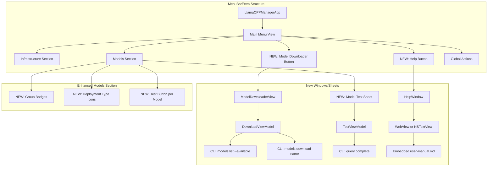

# Phase 4: GUI Enhancements Architecture
**File:** /Users/liborballaty/LocalProjects/GitHubProjectsDocuments/llamaCPPManager/docs/phase4-gui-architecture.md
**Description:** Architectural design for GUI enhancements including model downloader, sanity testing, help system, and container management
**Author:** Libor Ballaty <libor@arionetworks.com>
**Created:** 2025-10-10

## Overview

Phase 4 adds comprehensive GUI enhancements to llamaCPPManager, enabling users to download models, test them, access documentation, and manage deployments entirely from the menu bar interface.

## Goals

1. **Model Downloader UI** - Browse and download models from Hugging Face without CLI
2. **Sanity Testing** - Quick query interface to verify model responses
3. **Integrated Help** - Comprehensive documentation accessible from the app
4. **Model Groups View** - Visual representation of exclusive groups
5. **Container Management** (Optional) - GUI for Docker/containerized deployments

## Current GUI Architecture

### Existing Components

```
gui-macos/Sources/
└── App.swift (SwiftUI MenuBarExtra)
    ├── StatusViewModel
    ├── Infrastructure Section
    ├── Models Section
    └── Global Actions
```

### Current Features
- Real-time status monitoring (polling every 2s)
- Model start/stop/restart controls
- Infrastructure component management
- Log viewing
- Chat interface
- Monitor toggle

## Phase 4 Architecture

### New SwiftUI Views



## Component Specifications

### 1. Model Downloader View

**Location:** `gui-macos/Sources/Views/ModelDownloaderView.swift`

**Features:**
- List all available models from `CODING_MODELS` dictionary
- Display model metadata (size, RAM, use case, description)
- Filter by: size, use case, model family
- Real-time download progress
- Auto-configure after download

**UI Layout:**
```
┌─────────────────────────────────────────────┐
│ Model Downloader                       [✕]  │
├─────────────────────────────────────────────┤
│ Filter: [All Models ▾] [Size ▾] [Use Case ▾]│
├─────────────────────────────────────────────┤
│ ┌─────────────────────────────────────────┐ │
│ │ 🤖 qwen-coder-7b                        │ │
│ │ Best for tool calling and structured    │ │
│ │ JSON outputs                            │ │
│ │                                         │ │
│ │ Size: 7.54 GB  RAM: ~12 GB              │ │
│ │ Use Case: Agentic workflows, tool       │ │
│ │ calling, function execution             │ │
│ │                                         │ │
│ │ Status: ✓ Downloaded                    │ │
│ │ [Configure] [Re-download]               │ │
│ └─────────────────────────────────────────┘ │
│                                             │
│ ┌─────────────────────────────────────────┐ │
│ │ 🤖 hermes-3-llama-8b                    │ │
│ │ Specifically trained for agentic use    │ │
│ │                                         │ │
│ │ Size: 7.95 GB  RAM: ~13 GB              │ │
│ │ Use Case: Multi-agent systems,          │ │
│ │ autonomous workflows                    │ │
│ │                                         │ │
│ │ Status: Not Downloaded                  │ │
│ │ [Download]                              │ │
│ │                                         │ │
│ │ Progress: ▓▓▓▓▓▓░░░░ 65% (4.8/7.95 GB) │ │
│ │ Speed: 12.4 MB/s  ETA: 4m 23s           │ │
│ └─────────────────────────────────────────┘ │
└─────────────────────────────────────────────┘
```

**ViewModel:** `DownloadViewModel`
```swift
class DownloadViewModel: ObservableObject {
    @Published var availableModels: [ModelInfo] = []
    @Published var downloads: [String: DownloadProgress] = [:]
    @Published var filterSize: FilterOption = .all
    @Published var filterUseCase: FilterOption = .all

    func fetchAvailableModels()
    func downloadModel(name: String)
    func configureDownloadedModel(name: String)
    func cancelDownload(name: String)
}

struct ModelInfo {
    let name: String
    let repoId: String
    let filename: String
    let sizeGB: Double
    let ramGB: Int
    let useCase: String
    let description: String
    let isDownloaded: Bool
}

struct DownloadProgress {
    let bytesDownloaded: Int64
    let totalBytes: Int64
    let speedMBps: Double
    let etaSeconds: Int
}
```

**CLI Integration:**
```bash
# Fetch available models
llamacpp-manager models list --available --json

# Download model with progress
llamacpp-manager models download qwen-coder-7b --json

# Get download status (polling)
llamacpp-manager models download-status qwen-coder-7b --json
```

### 2. Model Sanity Testing View

**Location:** `gui-macos/Sources/Views/ModelTestSheet.swift`

**Features:**
- Quick test prompt entry
- Response display with formatting
- Performance metrics (latency, tokens/sec)
- Save/recall test prompts
- Group warning for exclusive models

**UI Layout:**
```
┌────────────────────────────────────────────┐
│ Test Model: qwen-coder-7b             [✕]  │
├────────────────────────────────────────────┤
│ ⚠️  This will stop hermes-3-llama-8b       │
├────────────────────────────────────────────┤
│ Test Prompt:                               │
│ ┌────────────────────────────────────────┐ │
│ │ Explain the role of agentic AI in 2-3 │ │
│ │ sentences.                             │ │
│ └────────────────────────────────────────┘ │
│                                            │
│ Saved Prompts: [Compliance Query ▾]       │
│                                            │
│ Max Tokens: [100 ]  Temperature: [0.7 ]   │
│                                            │
│ [Send Query]  [Clear]                      │
├────────────────────────────────────────────┤
│ Response:                                  │
│ ┌────────────────────────────────────────┐ │
│ │ An agentic AI system is designed to    │ │
│ │ take autonomous actions to achieve     │ │
│ │ goals it has been programmed to        │ │
│ │ pursue...                               │ │
│ └────────────────────────────────────────┘ │
│                                            │
│ Performance:                               │
│ ⏱️  Response Time: 1.2s                    │
│ 🚀 Tokens/sec: 42.5                        │
│ 📊 Total Tokens: 51                        │
└────────────────────────────────────────────┘
```

**ViewModel:** `TestViewModel`
```swift
class TestViewModel: ObservableObject {
    @Published var modelName: String
    @Published var testPrompt: String = ""
    @Published var response: String = ""
    @Published var isLoading: Bool = false
    @Published var savedPrompts: [SavedPrompt] = []
    @Published var maxTokens: Int = 100
    @Published var temperature: Double = 0.7
    @Published var performance: PerformanceMetrics?

    func sendQuery()
    func loadSavedPrompt(id: String)
    func saveCurrentPrompt(name: String)
    func clearResponse()
}

struct PerformanceMetrics {
    let responseTimeMs: Int
    let tokensPerSec: Double
    let totalTokens: Int
}

struct SavedPrompt: Identifiable {
    let id: String
    let name: String
    let prompt: String
}
```

**CLI Integration:**
```bash
# Test model with query
llamacpp-manager query complete MODEL_NAME "PROMPT" \
  --max-tokens 100 \
  --temperature 0.7 \
  --json

# Output includes performance metrics
{
  "response": "...",
  "latency_ms": 1200,
  "tokens_generated": 51,
  "tokens_per_sec": 42.5
}
```

### 3. Help & Documentation View

**Location:** `gui-macos/Sources/Views/HelpWindow.swift`

**Features:**
- Embedded user manual with full formatting
- Keyword search across documentation
- Section navigation (table of contents)
- Contextual help links
- Version-specific updates highlighting

**UI Layout:**
```
┌──────────────────────────────────────────────┐
│ llamaCPP Manager Help                   [✕]  │
├──────────────────────────────────────────────┤
│ Search: [keyword search          ] [🔍]     │
├─────────────┬────────────────────────────────┤
│ Navigation  │ Content                        │
│             │                                │
│ Overview    │ # llamaCPP Manager User Manual │
│ Installation│                                │
│ Quick Start │ A complete guide to managing   │
│ Models      │ llama.cpp models across        │
│ ├─ Download │ different deployment scenarios │
│ ├─ Groups   │ on macOS.                      │
│ ├─ Testing  │                                │
│ Deployment  │ ## Table of Contents           │
│ ├─ Native   │                                │
│ ├─ Container│ 1. Overview                    │
│ ├─ K8s      │ 2. Installation                │
│ Infra       │ 3. Model Management            │
│ MCP         │ 4. Model Downloader ⭐ NEW    │
│ Trouble     │ 5. Model Groups                │
│             │ 6. Testing Models              │
│ What's New  │ ...                            │
└─────────────┴────────────────────────────────┘
```

**Implementation:**
```swift
struct HelpWindow: View {
    @State private var searchText = ""
    @State private var selectedSection: String? = nil
    @State private var markdownContent: String

    init() {
        // Load user-manual.md from bundle
        markdownContent = loadUserManual()
    }

    var body: some View {
        HSplitView {
            // Navigation sidebar
            NavigationView()

            // Content view with markdown rendering
            ScrollView {
                MarkdownView(content: filteredContent)
            }
        }
    }

    func loadUserManual() -> String {
        // Load from docs/user-manual.md
    }

    var filteredContent: String {
        // Apply search filter
    }
}
```

**Content Embedding:**
- Include `docs/user-manual.md` in GUI app bundle
- Use SwiftUI Markdown rendering (macOS 14+)
- Fallback to NSTextView with AttributedString for older macOS

### 4. Enhanced Model Groups View

**Location:** Enhance existing `Models Section` in `App.swift`

**New Features:**
- Group badges next to model names
- Hover tooltip showing group details
- Visual indicator for active model in group
- Launch confirmation when stopping sibling

**UI Enhancement:**
```
Models
─────────────────────────────────────────────
🟢 qwen-coder-7b         127.0.0.1:8085
   Best for tool calling  12 ms  up 00:37:45
   [agentic-models] [native] ⭐ ACTIVE

   [Stop] [Restart] [Test] [Monitor] [Logs]
─────────────────────────────────────────────
⚫ hermes-3-llama-8b      127.0.0.1:8086
   Multi-agent systems    --     stopped
   [agentic-models] [native]

   [Start] ⚠️ Will stop qwen-coder-7b
─────────────────────────────────────────────
⚫ llama-3.1-8b           127.0.0.1:8087
   Compliance reports     --     stopped
   [agentic-models] [native]

   [Start] ⚠️ Will stop qwen-coder-7b
─────────────────────────────────────────────
```

**Implementation:**
```swift
// Add to StatusRow struct
struct StatusRow {
    let name: String
    let group: String?        // NEW
    let deployment: String    // NEW: "native", "container", "k8s"
    let metadata: ModelMetadata?  // NEW
    // ... existing fields
}

struct ModelMetadata {
    let sizeGB: Double
    let ramGB: Int
    let useCase: String
    let description: String
}

// Group badge view
struct GroupBadge: View {
    let groupName: String
    let isExclusive: Bool
    let isActive: Bool

    var body: some View {
        HStack(spacing: 2) {
            Image(systemName: isExclusive ? "lock.fill" : "folder.fill")
            Text(groupName)
        }
        .font(.caption2)
        .padding(2)
        .background(isActive ? Color.orange : Color.gray)
        .foregroundColor(.white)
        .cornerRadius(4)
        .help(groupTooltip)
    }

    var groupTooltip: String {
        if isExclusive {
            return "Exclusive group: \(groupName)\nOnly one model can run at a time"
        } else {
            return "Group: \(groupName)"
        }
    }
}
```

### 5. Container Management UI (Optional)

**Location:** `gui-macos/Sources/Views/ContainerManagementView.swift`

**Features:**
- Docker availability detection
- Container build interface
- Resource usage monitoring
- Container-specific controls

**UI Layout:**
```
┌────────────────────────────────────────────┐
│ Container Management                  [✕]  │
├────────────────────────────────────────────┤
│ Docker Status: ✓ Running (Colima)         │
├────────────────────────────────────────────┤
│ Containerized Models:                      │
│                                            │
│ ┌────────────────────────────────────────┐ │
│ │ experimental-model                     │ │
│ │ Container ID: abc123def456             │ │
│ │                                        │ │
│ │ Resource Usage:                        │ │
│ │ Memory: 2.1 GB / 4.0 GB (52%)         │ │
│ │ CPU: 1.2 / 2.0 cores (60%)            │ │
│ │                                        │ │
│ │ [Stop] [Restart] [Rebuild] [Remove]   │ │
│ └────────────────────────────────────────┘ │
│                                            │
│ Native Models → Container:                 │
│ [Select Model ▾]  [Containerize]          │
└────────────────────────────────────────────┘
```

## CLI Extensions Required

### New Commands

```bash
# Model download status (for progress tracking)
llamacpp-manager models download-status <name> --json
# Returns: { "status": "downloading", "progress": 0.65, "speed_mbps": 12.4, "eta_sec": 263 }

# Enhanced status with metadata
llamacpp-manager status --include-metadata --json
# Includes: group, deployment_type, metadata (size_gb, ram_gb, use_case)

# Save/load test prompts
llamacpp-manager test save-prompt --name "Compliance Query" --prompt "..."
llamacpp-manager test list-prompts --json
llamacpp-manager test load-prompt "Compliance Query"

# Container commands (if Phase 4 includes containers)
llamacpp-manager container status <name> --json
llamacpp-manager container build <name> --json
llamacpp-manager container resource-usage <name> --json
```

### Enhanced JSON Output

**status --json with metadata:**
```json
{
  "models": [
    {
      "name": "qwen-coder-7b",
      "host": "127.0.0.1",
      "port": 8085,
      "up": true,
      "latency_ms": 12,
      "uptime": "00:37:45",
      "group": "agentic-models",
      "deployment_type": "native",
      "metadata": {
        "size_gb": 7.54,
        "ram_gb": 12,
        "use_case": "Agentic workflows, tool calling, function execution, JSON outputs",
        "description": "Best for tool calling and structured outputs"
      }
    }
  ]
}
```

## Implementation Plan

### Phase 4.1: Model Downloader (Week 1)
1. Create `ModelDownloaderView.swift`
2. Implement `DownloadViewModel`
3. Add CLI command: `models download-status`
4. Add "Download Models" button to main menu
5. Test download flow with small model

### Phase 4.2: Sanity Testing (Week 1)
1. Create `ModelTestSheet.swift`
2. Implement `TestViewModel`
3. Add "Test" button to each model row
4. Implement saved prompts storage (UserDefaults)
5. Add performance metrics to query command

### Phase 4.3: Help System (Week 2)
1. Create `HelpWindow.swift`
2. Bundle `user-manual.md` in GUI app
3. Implement markdown rendering
4. Add search functionality
5. Add "Help" button to main menu

### Phase 4.4: Enhanced Model Groups (Week 2)
1. Update `StatusRow` to include group and metadata
2. Create `GroupBadge` view
3. Update `status --json` to include group info
4. Add hover tooltips
5. Add launch confirmation for exclusive groups

### Phase 4.5: Container Management (Optional - Week 3)
1. Create `ContainerManagementView.swift`
2. Implement Docker detection
3. Add container resource monitoring
4. Add containerization workflow
5. Test with Docker and Colima

## File Structure

```
gui-macos/
├── Sources/
│   ├── App.swift (enhanced)
│   ├── ViewModels/
│   │   ├── StatusViewModel.swift (existing)
│   │   ├── DownloadViewModel.swift (new)
│   │   ├── TestViewModel.swift (new)
│   │   └── ContainerViewModel.swift (new, optional)
│   ├── Views/
│   │   ├── ModelDownloaderView.swift (new)
│   │   ├── ModelTestSheet.swift (new)
│   │   ├── HelpWindow.swift (new)
│   │   ├── GroupBadge.swift (new)
│   │   └── ContainerManagementView.swift (new, optional)
│   ├── Models/
│   │   ├── StatusRow.swift (enhanced)
│   │   ├── ModelInfo.swift (new)
│   │   ├── DownloadProgress.swift (new)
│   │   └── PerformanceMetrics.swift (new)
│   └── Resources/
│       └── user-manual.md (bundled)
└── Package.swift (update dependencies if needed)
```

## Testing Strategy

### Unit Tests
- ViewModel logic (parsing JSON, state management)
- Model data transformations
- Filter logic for model downloader

### Integration Tests
- CLI command execution and parsing
- Download progress tracking
- Model testing workflow

### Manual Testing
- Download models of various sizes
- Test models with different prompts
- Navigate help documentation
- Verify group exclusivity in GUI
- Test container operations (if implemented)

## Success Criteria

1. **Model Downloader**
   - ✅ Can browse all available models
   - ✅ Can download models with real-time progress
   - ✅ Models auto-configure after download
   - ✅ Can filter models by criteria

2. **Sanity Testing**
   - ✅ Can send test queries to any model
   - ✅ Can see performance metrics
   - ✅ Can save/recall test prompts
   - ✅ Warnings shown for exclusive groups

3. **Help System**
   - ✅ Full user manual accessible from GUI
   - ✅ Search works across all content
   - ✅ Navigation is intuitive
   - ✅ Help opens to relevant sections

4. **Model Groups**
   - ✅ Group badges visible on all models
   - ✅ Active model highlighted
   - ✅ Tooltips show group details
   - ✅ Launch warnings for exclusivity

5. **Container Management** (Optional)
   - ✅ Docker status detection
   - ✅ Container resource monitoring
   - ✅ Build/deploy workflow functional

## Next Steps

1. Review this architecture with stakeholders
2. Create feature branch: `feature/gui-phase4`
3. Start with Phase 4.1 (Model Downloader)
4. Iterate based on user feedback
5. Document new GUI features in user manual
