# llamaCPP Manager User Manual

A complete guide to managing llama.cpp models across different deployment scenarios on macOS.

## Table of Contents

1. [Overview](#overview)
2. [Installation](#installation)
3. [Deployment Scenarios](#deployment-scenarios)
4. [Scenario 1: Bare-Metal (Native macOS)](#scenario-1-bare-metal-native-macos)
5. [Scenario 2: Container (Docker/Colima)](#scenario-2-container-dockercolima)
6. [Scenario 3: Kubernetes (Remote Clusters)](#scenario-3-kubernetes-remote-clusters)
7. [Common Operations](#common-operations)
8. [GUI Usage](#gui-usage)
9. [Troubleshooting](#troubleshooting)
10. [Advanced Configuration](#advanced-configuration)

## Overview

llamaCPP Manager provides three deployment scenarios for running llama.cpp models:

| Scenario | Best For | Requirements | Pros | Cons |
|----------|----------|--------------|------|------|
| **Bare-Metal** | Local development, testing | macOS + llama.cpp binary | Fast, simple setup | Resource sharing, no isolation |
| **Container** | Isolation, consistent environments | Docker/Colima | Process isolation, easy cleanup | Overhead, Docker complexity |
| **Kubernetes** | Production, scaling, remote deployment | K8s cluster + kubectl | Scalability, HA, resource management | Complex setup, network overhead |

### Architecture Overview

The following diagram shows how llamaCPP Manager orchestrates different deployment scenarios:

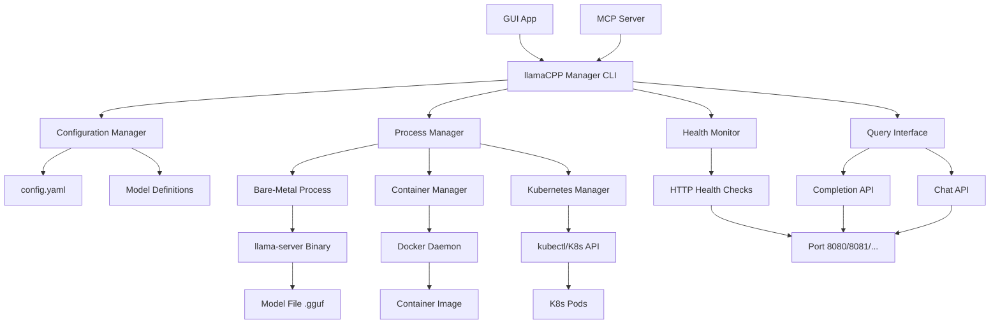

### Network Connectivity Overview

```mermaid
graph TB
    subgraph "External Access Layer"
        A[Web Browser] --> B[http://localhost:8081]
        C[curl/API Client] --> D[http://localhost:8082]
        E[GUI Application] --> F[llamaCPP Manager CLI]
        G[MCP Client] --> H[MCP Server Port]
    end

    subgraph "llamaCPP Manager Control Plane"
        F --> I[Process Manager]
        F --> J[Config Manager]
        F --> K[Health Monitor]
        F --> L[Query Interface]

        J --> M[config.yaml<br/>~/.config/llamacpp/]
        K --> N[Health Check Loop<br/>Every 30s]
        L --> O[HTTP Client Pool]
    end

    subgraph "Deployment Layer - Bare Metal"
        I --> P1[Native Process 1<br/>PID 1234]
        I --> P2[Native Process 2<br/>PID 1235]

        P1 --> Q1[Socket: 127.0.0.1:8081<br/>Model: smollm3]
        P2 --> Q2[Socket: 127.0.0.1:8082<br/>Model: codellama]

        B --> Q1
        D --> Q2
    end

    subgraph "Deployment Layer - Container"
        I --> R[Docker Daemon]
        R --> S1[Container 1<br/>llamacpp-model1]
        R --> S2[Container 2<br/>llamacpp-model2]

        S1 --> T1[Internal: 0.0.0.0:8080<br/>External: 127.0.0.1:8083]
        S2 --> T2[Internal: 0.0.0.0:8080<br/>External: 127.0.0.1:8084]

        U1[Volume Mount<br/>~/llms/model1.gguf] --> S1
        U2[Volume Mount<br/>~/llms/model2.gguf] --> S2
    end

    subgraph "Deployment Layer - Kubernetes"
        I --> V[kubectl Client]
        V --> W[K8s API Server<br/>https://cluster:6443]

        W --> X1[Pod 1: model-deployment-abc]
        W --> X2[Pod 2: model-deployment-def]
        W --> X3[Pod 3: model-deployment-ghi]

        Y[Service: model-svc<br/>ClusterIP:8080] --> X1
        Y --> X2
        Y --> X3

        Z[kubectl port-forward<br/>8085:8080] --> Y
        AA[Ingress<br/>model.example.com] --> Y
    end

    subgraph "Storage Layer"
        BB[Local File System<br/>~/llms/] --> P1
        BB --> P2
        BB --> U1
        BB --> U2

        CC[Container Registry<br/>your-registry.com] --> S1
        CC --> S2
        CC --> X1
        CC --> X2
        CC --> X3

        DD[Persistent Volume<br/>NFS/EBS] --> X1
        DD --> X2
        DD --> X3
    end

    subgraph "Monitoring & Logs"
        N --> Q1
        N --> Q2
        N --> T1
        N --> T2
        N --> Y

        EE[Log Files<br/>~/logs/] --> P1
        EE --> P2
        FF[Container Logs<br/>docker logs] --> S1
        FF --> S2
        GG[Pod Logs<br/>kubectl logs] --> X1
        GG --> X2
        GG --> X3
    end

    subgraph "Network Policies & Security"
        HH[Host Firewall<br/>127.0.0.1 only] --> Q1
        HH --> Q2
        II[Container Network<br/>Bridge Mode] --> T1
        II --> T2
        JJ[K8s Network Policy<br/>Ingress/Egress] --> Y
        JJ --> AA
    end
```

### Endpoint Flow Architecture

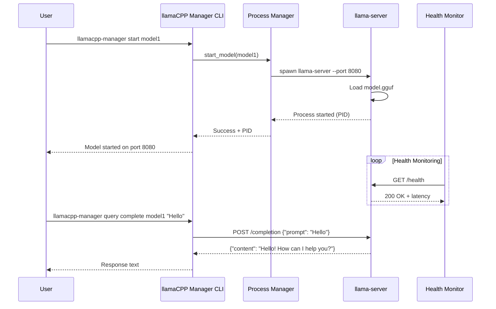

## Installation

### Prerequisites

- **macOS** (Ventura or newer, Apple Silicon recommended)
- **Python 3.9+**
- **pipx** (recommended) or **pip**

### Install llamaCPP Manager

```bash
# Option 1: Using pipx (recommended)
pipx install /path/to/llamacpp-manager

# Option 2: Using pip in virtual environment
python3 -m venv .venv
source .venv/bin/activate
pip install -e /path/to/llamacpp-manager

# Option 3: Development install
git clone <repo-url>
cd llamacpp-manager
pipx install --suffix=@local .
```

### Verify Installation

```bash
llamacpp-manager --help
llamacpp-manager --version
```

### Post-Installation Setup

#### Optional: Install Monitoring Daemon (Recommended)

The monitoring daemon provides automatic health checks and crash recovery for models and infrastructure:

```bash
# Install monitoring daemon as launchd agent (auto-starts on boot)
llamacpp-manager monitor launchd install

# Verify installation
llamacpp-manager monitor launchd status
```

#### Optional: Install GUI Auto-Start

Configure the menu bar app to launch automatically on login:

```bash
# Build and install GUI app first
cd gui-macos
./build_app.sh
cp -R "build/llamaCPP Manager.app" /Applications/

# Install GUI auto-start
./install_gui_launchagent.sh
```

## Deployment Scenarios

Choose your deployment scenario based on your needs:

```bash
# Initialize with custom directories (recommended)
llamacpp-manager --config-dir ~/Configs/llamacpp --log-dir ~/Logs/llamacpp init
```

**💡 Pro Tip:** Use custom config/log directories to keep your setup organized and separate from any repository.

---

## Scenario 1: Bare-Metal (Native macOS)

**Best for:** Local development, testing, quick experimentation

### Bare-Metal Architecture

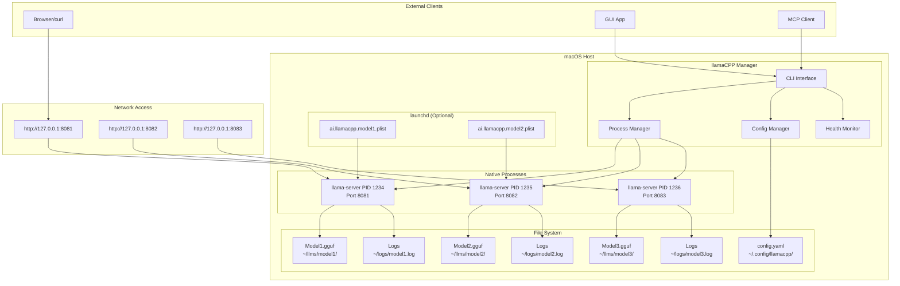

### Bare-Metal Network Flow

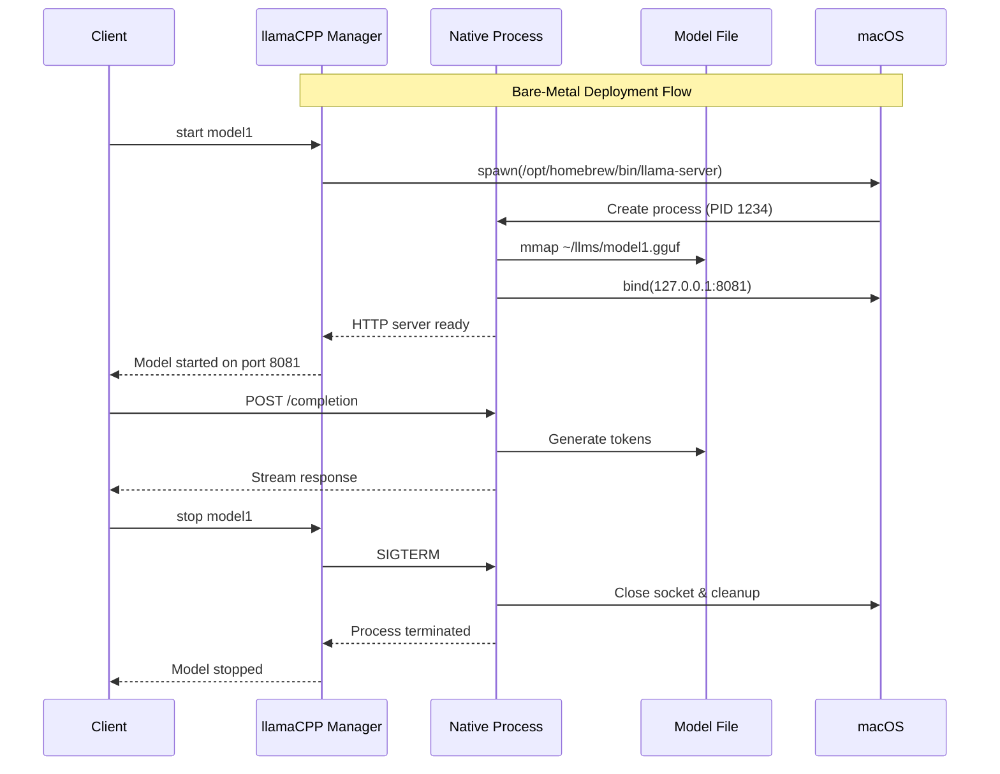

### Step 1: Install llama.cpp

```bash
# Option 1: Homebrew (recommended)
brew install llama.cpp

# Option 2: Build from source
git clone https://github.com/ggerganov/llama.cpp.git
cd llama.cpp
make -j

# Verify installation
which llama-server  # Should show: /opt/homebrew/bin/llama-server
```

### Step 2: Initialize Configuration

```bash
# Initialize with default paths
llamacpp-manager init

# Or with custom paths (recommended)
llamacpp-manager --config-dir ~/Configs/llamacpp --log-dir ~/Logs/llamacpp init
```

### Step 3: Add Your First Model

```bash
# Download a model (example)
mkdir -p ~/llms/smollm3
cd ~/llms/smollm3
wget https://huggingface.co/bartowski/SmolLM2-1.7B-Instruct-GGUF/resolve/main/SmolLM2-1.7B-Instruct-Q8_0.gguf

# Add model to configuration
llamacpp-manager config add smollm3 \
  ~/llms/smollm3/SmolLM2-1.7B-Instruct-Q8_0.gguf \
  --port 8081 \
  --extra-args "-c 8192 -ngl 9999 -t 12 --parallel 4 --cont-batching"
```

### Step 4: Start and Test Your Model

```bash
# Start the model
llamacpp-manager start smollm3

# Check status
llamacpp-manager status

# Test with a query
llamacpp-manager query complete smollm3 "Hello, world!"

# Stop the model
llamacpp-manager stop smollm3
```

### Step 5: Enable Auto-Start (Optional)

```bash
# Enable auto-start in config
llamacpp-manager config update smollm3 --autostart true

# Install launchd service (keeps model running)
llamacpp-manager launchd install smollm3

# Check if it's running
llamacpp-manager status

# Ensure auto-start models are running
llamacpp-manager ensure-running --mode launchd
```

### Bare-Metal Workflow Summary

```bash
# Daily workflow
llamacpp-manager status                    # Check what's running
llamacpp-manager start mymodel            # Start specific model
llamacpp-manager query chat mymodel --message "user:Hello"  # Chat
llamacpp-manager logs mymodel --tail      # View logs
llamacpp-manager stop mymodel             # Stop when done
```

---

## Scenario 2: Container (Docker/Colima)

**Best for:** Process isolation, consistent environments, easy cleanup

### Container Architecture

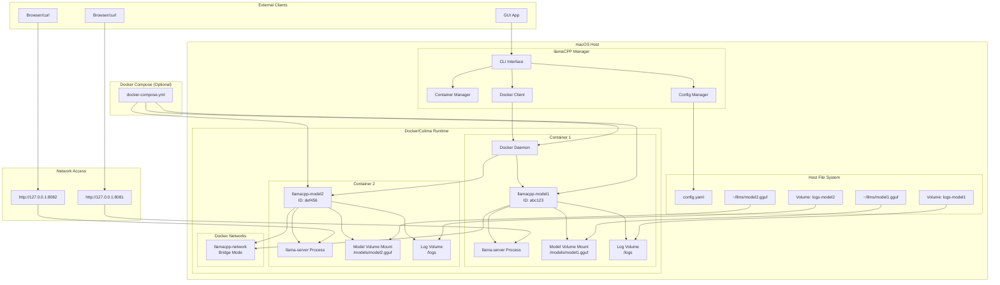

### Container Network Flow

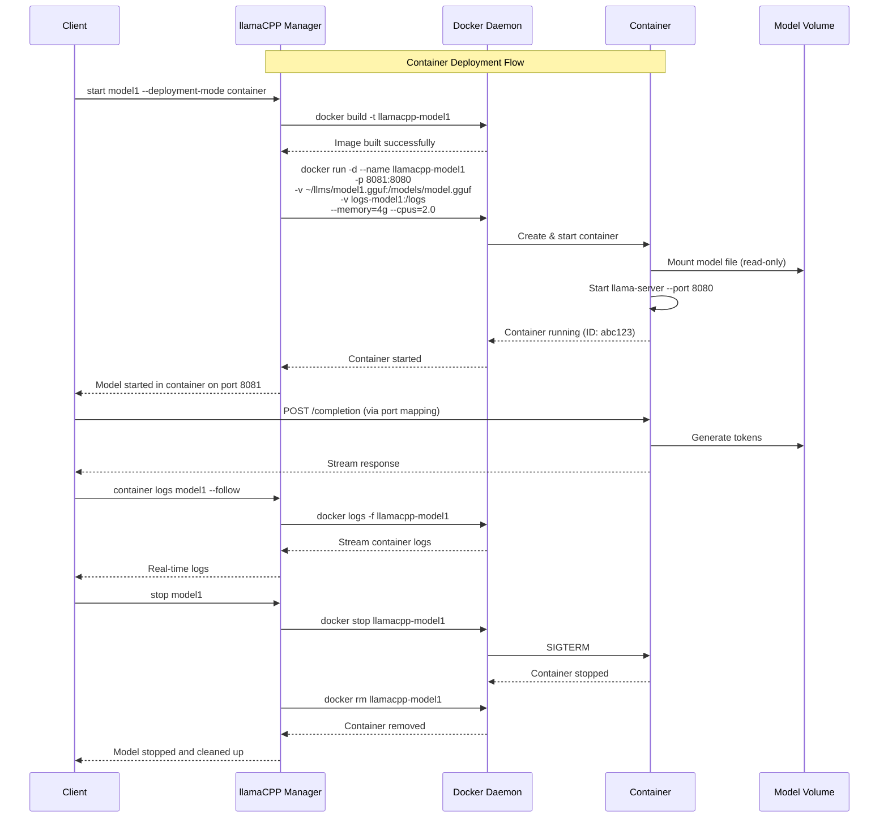

### Step 1: Install Docker/Colima

```bash
# Option 1: Docker Desktop (easiest)
# Download from: https://www.docker.com/products/docker-desktop/

# Option 2: Colima (lightweight, recommended for developers)
brew install colima docker

# Start Colima
colima start

# Verify Docker is running
docker ps
```

### Step 2: Initialize llamaCPP Manager

```bash
# Initialize configuration
llamacpp-manager --config-dir ~/Configs/llamacpp --log-dir ~/Logs/llamacpp init
```

### Step 3: Add Container-Based Model

```bash
# Add model with container deployment mode
llamacpp-manager config add smollm3-container \
  ~/llms/smollm3/SmolLM2-1.7B-Instruct-Q8_0.gguf \
  --port 8082 \
  --deployment-mode container \
  --extra-args "-c 8192 -ngl 9999"
```

### Step 4: Build and Deploy Container

```bash
# Build Docker image for the model
llamacpp-manager container build smollm3-container

# Start containerized model
llamacpp-manager start smollm3-container

# Check container status
llamacpp-manager status
docker ps  # See running containers
```

### Step 5: Container Management

```bash
# View container logs
llamacpp-manager container logs smollm3-container --follow

# Check resource usage
llamacpp-manager status --resources

# Scale container (if using Docker Compose)
llamacpp-manager container scale smollm3-container --replicas 2

# Clean up container and images
llamacpp-manager container cleanup smollm3-container
```

### Container Configuration Options

```bash
# Advanced container configuration
llamacpp-manager config add advanced-model \
  ~/llms/model.gguf \
  --port 8083 \
  --deployment-mode container \
  --container-memory 4g \
  --container-cpus 2.0 \
  --container-registry my-registry.com \
  --extra-args "-c 16384 -ngl 9999"
```

### Docker Compose Multi-Model Setup

```bash
# Add multiple container models
llamacpp-manager config add model1 ~/llms/model1.gguf --port 8081 --deployment-mode container
llamacpp-manager config add model2 ~/llms/model2.gguf --port 8082 --deployment-mode container

# Generate and start all via Docker Compose
llamacpp-manager start all --mode compose

# Check all services
llamacpp-manager status
```

---

## Scenario 3: Kubernetes (Remote Clusters)

**Best for:** Production deployments, scaling, high availability

### Kubernetes Architecture

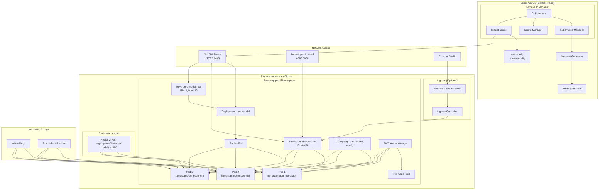

### Kubernetes Network Flow

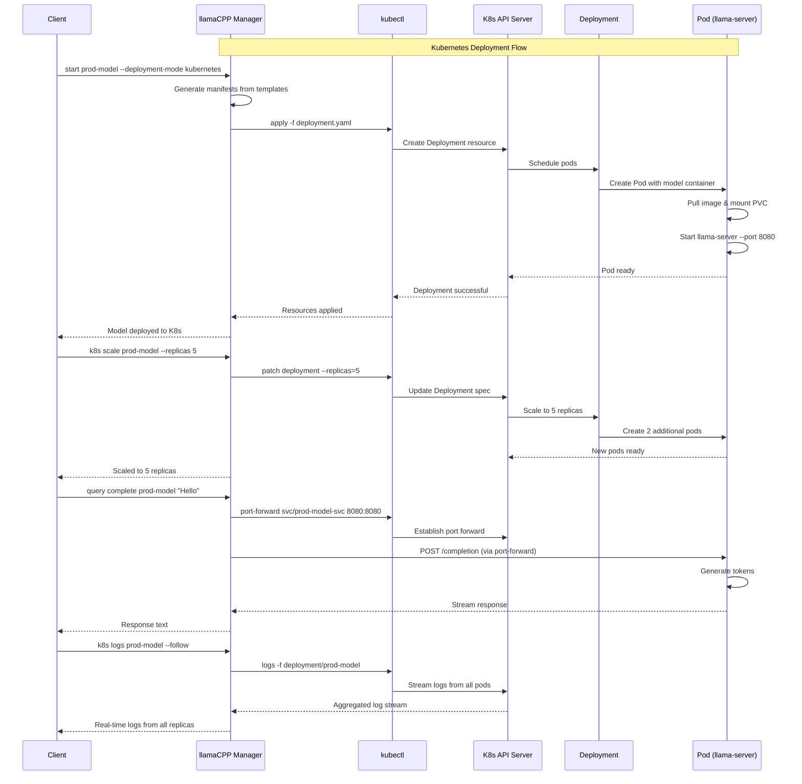

### Kubernetes Resource Topology

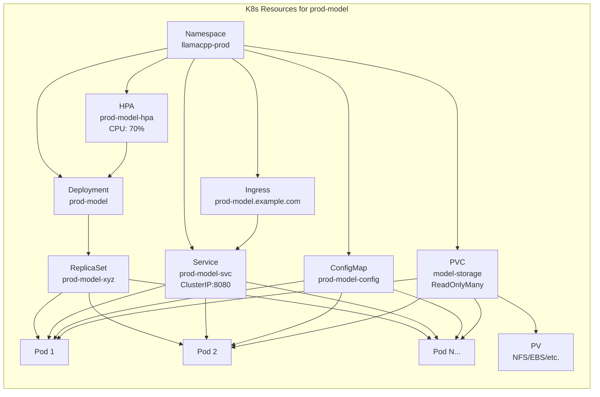

### Step 1: Prepare Kubernetes Environment

```bash
# Install kubectl
brew install kubectl

# Verify cluster access (example contexts)
kubectl config get-contexts

# Test cluster connectivity
kubectl cluster-info
```

### Step 2: Set Up Container Registry (if needed)

```bash
# Build and push model image to registry
llamacpp-manager container build mymodel --push
docker tag mymodel:latest your-registry.com/mymodel:latest
docker push your-registry.com/mymodel:latest
```

### Step 3: Configure Kubernetes Model

```bash
# Add model with Kubernetes deployment
llamacpp-manager config add prod-model \
  ~/llms/production-model.gguf \
  --port 8080 \
  --deployment-mode kubernetes \
  --k8s-namespace llamacpp-prod \
  --k8s-replicas 3 \
  --k8s-registry your-registry.com \
  --k8s-context prod-cluster
```

### Step 4: Deploy to Kubernetes

```bash
# Generate manifests (optional - to review)
llamacpp-manager k8s manifest prod-model --output ./k8s-manifests

# Deploy to cluster
llamacpp-manager start prod-model

# Check deployment status
llamacpp-manager status
kubectl get pods -n llamacpp-prod
```

### Step 5: Kubernetes Operations

```bash
# Scale deployment
llamacpp-manager k8s scale prod-model --replicas 5

# View logs from all pods
llamacpp-manager k8s logs prod-model --follow

# Check detailed K8s status
llamacpp-manager k8s status prod-model

# Update deployment
llamacpp-manager restart prod-model

# Remove from cluster
llamacpp-manager k8s cleanup prod-model
```

### Advanced Kubernetes Configuration

```yaml
# Example ~/.config/llamacpp/config.yaml
models:
  prod-model:
    model_path: /models/production-model.gguf
    port: 8080
    deployment_mode: kubernetes
    kubernetes:
      namespace: llamacpp-prod
      context: prod-cluster
      replicas:
        initial: 3
        min: 2
        max: 10
      resources:
        requests:
          memory: "2Gi"
          cpu: "1000m"
        limits:
          memory: "4Gi"
          cpu: "2000m"
      image:
        registry: your-registry.com
        repository: llamacpp-models
        tag: v1.0.0
      hpa_enabled: true  # Horizontal Pod Autoscaling
```

---

## Common Operations

### Model Management

```bash
# List all models
llamacpp-manager config list

# Add model
llamacpp-manager config add MODEL_NAME /path/to/model.gguf --port PORT

# Remove model
llamacpp-manager config remove MODEL_NAME

# Update model settings
llamacpp-manager config update MODEL_NAME --autostart true --port 8090
```

### Process Control

```bash
# Start models
llamacpp-manager start MODEL_NAME        # Start specific model
llamacpp-manager start all               # Start all configured models

# Stop models
llamacpp-manager stop MODEL_NAME         # Stop specific model
llamacpp-manager stop all                # Stop all running models

# Restart
llamacpp-manager restart MODEL_NAME      # Restart specific model
```

### Status and Monitoring

```bash
# Check status
llamacpp-manager status                  # Human-readable status
llamacpp-manager status --json          # JSON format for scripts
llamacpp-manager status --watch         # Continuous monitoring

# View logs
llamacpp-manager logs MODEL_NAME --tail 100
llamacpp-manager logs MODEL_NAME --follow
```

### Querying Models

```bash
# Text completion
llamacpp-manager query complete MODEL_NAME "Once upon a time"
llamacpp-manager query complete MODEL_NAME "Hello" --max-tokens 100 --temperature 0.7

# Chat interface
llamacpp-manager query chat MODEL_NAME --message "user:Hello there"
llamacpp-manager query chat MODEL_NAME --message "system:Be helpful" --message "user:Explain AI"

# Streaming responses
llamacpp-manager query complete MODEL_NAME "Tell me a story" --stream
llamacpp-manager query chat MODEL_NAME --message "user:Count to 10" --stream
```

---

## Infrastructure Management

llamaCPP Manager can also manage supporting infrastructure components like cloudflared tunnel and LLM controller alongside your models.

### Infrastructure Architecture

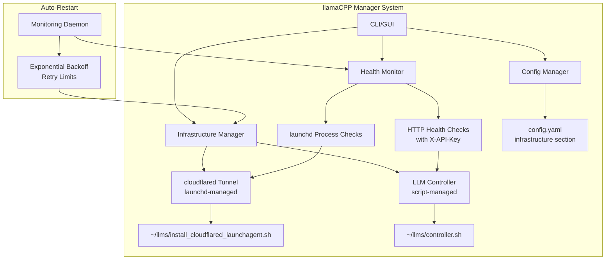

### Infrastructure Components

Infrastructure components are defined in `~/.config/llamacpp/config.yaml`:

```yaml
infrastructure:
  cloudflared:
    enabled: true
    type: launchd_managed
    launchd_label: llms.tunnel
    installer_script: ~/llms/install_cloudflared_launchagent.sh
    health_check:
      type: launchd_process
      label: llms.tunnel

  llm_controller:
    enabled: true
    type: script_managed
    management_script: ~/llms/controller.sh
    health_check:
      type: http
      endpoint: http://127.0.0.1:8090/status
      headers:
        X-API-Key: your-api-key
      expected_status: 200
      timeout: 5.0
    auto_restart:
      enabled: true
      max_retries: 3
      backoff_multiplier: 2.0
      failure_threshold: 3
```

### Infrastructure Commands

```bash
# List configured infrastructure components
llamacpp-manager infra list

# View infrastructure status
llamacpp-manager infra status

# Control individual components
llamacpp-manager infra start cloudflared
llamacpp-manager infra start llm_controller
llamacpp-manager infra stop cloudflared
llamacpp-manager infra stop llm_controller
llamacpp-manager infra restart llm_controller

# View component logs
llamacpp-manager infra logs llm_controller
llamacpp-manager infra logs cloudflared

# View combined status (models + infrastructure)
llamacpp-manager status --json
```

### Example Infrastructure Operations

```bash
# Check what infrastructure is configured
$ llamacpp-manager infra list
Infrastructure Components:
  cloudflared (launchd_managed) - enabled
    Launchd label: llms.tunnel
    Installer script: ~/llms/install_cloudflared_launchagent.sh
  llm_controller (script_managed) - enabled
    Management script: ~/llms/controller.sh

# Check infrastructure status
$ llamacpp-manager infra status
Infrastructure Component Status:
  ✓ cloudflared: running (PID 1234)
  ✓ llm_controller: ok (200 OK, 5ms)

# Start a stopped component
$ llamacpp-manager infra start llm_controller
Starting llm_controller...
✓ llm_controller started successfully

# View component logs
$ llamacpp-manager infra logs llm_controller
[2025-10-02 10:15:30] Controller starting...
[2025-10-02 10:15:31] Health endpoint listening on :8090
[2025-10-02 10:15:31] Controller ready
```

---

## Health Monitoring & Auto-Restart

llamaCPP Manager includes a monitoring daemon that continuously checks the health of models and infrastructure components, automatically restarting them if they crash or become unhealthy.

### Monitoring Architecture

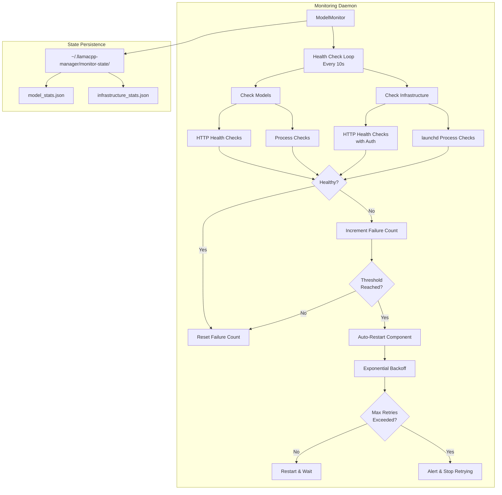

### Monitoring Commands

```bash
# Track a model for auto-restart
llamacpp-manager monitor track smollm3

# Stop tracking a model
llamacpp-manager monitor untrack smollm3

# View monitoring status
llamacpp-manager monitor status

# View detailed monitoring status
llamacpp-manager monitor status --detailed

# Manually start monitoring daemon
llamacpp-manager monitor start

# Stop monitoring daemon
llamacpp-manager monitor stop
```

### Installing Monitoring Daemon (Auto-Start on Boot)

```bash
# Install monitoring daemon as launchd agent
llamacpp-manager monitor launchd install

# Check if monitoring daemon is installed
llamacpp-manager monitor launchd status

# Uninstall monitoring daemon
llamacpp-manager monitor launchd uninstall
```

### Monitoring Configuration

The monitoring daemon uses the following default settings (configurable per component):

- **Check Interval**: 10 seconds
- **Failure Threshold**: 3 consecutive failures before restart
- **Max Retries**: 3 restart attempts
- **Backoff Multiplier**: 2.0 (wait time doubles each retry)
- **Initial Backoff**: 1 second

### Example Monitoring Workflow

```bash
# Install and start monitoring daemon
$ llamacpp-manager monitor launchd install
✓ Created launchd plist: ~/Library/LaunchAgents/com.llamacpp.manager.monitor.plist
✓ Monitoring daemon installed and loaded
  Label: com.llamacpp.manager.monitor
  The daemon will start automatically on boot
  Logs: ~/Library/Logs/llamaCPPManager/monitor-daemon.log

# Check status
$ llamacpp-manager monitor launchd status
✓ Monitoring daemon is loaded
  Label: com.llamacpp.manager.monitor
  Plist: ~/Library/LaunchAgents/com.llamacpp.manager.monitor.plist
  Status: installed and loaded
  PID: 5678

# Track models for auto-restart
$ llamacpp-manager monitor track smollm3
Now tracking 'smollm3' for auto-restart

$ llamacpp-manager monitor track mistral
Now tracking 'mistral' for auto-restart

# View monitoring status
$ llamacpp-manager monitor status --detailed
Monitor Status: RUNNING
Check Interval: 10s
State Directory: ~/.llamacpp-manager/monitor-state

Tracked Models:
Model        Health     Process    Port   Latency  Status
----------------------------------------------------------
smollm3      ok         running    8081   5        HTTP 200
mistral      ok         running    8082   8        HTTP 200

Infrastructure:
cloudflared   healthy    running    -      0        loaded
llm_controller ok         running    8090   12       HTTP 200
```

---

## GUI Usage

### Installation and Setup

1. **Build GUI** (from repo):
   ```bash
   cd gui-macos
   swift build
   ```

2. **Run from Xcode**:
   - Open `gui-macos/Package.swift` in Xcode
   - Run the `llamacpp-gui` scheme
   - App appears in menu bar as "llamaCPP"

3. **Environment Setup**:
   ```bash
   # Ensure CLI is in PATH or set environment variables
   export LLAMACPP_MANAGER_CONFIG_DIR=~/Configs/llamacpp
   export LLAMACPP_MANAGER_LOG_DIR=~/Logs/llamacpp
   ```

### GUI Features

The macOS menu bar GUI provides a comprehensive interface for managing both models and infrastructure:

**Infrastructure Section**:
- View cloudflared tunnel and LLM controller status
- Health indicators: 🟢 Healthy, 🟠 Unhealthy, 🔴 Stopped, ⚫ Disabled
- Control buttons: Start, Stop, Restart, Logs for each component
- Real-time status updates showing latency and health status

**Models Section**:
- View all configured models with detailed status
- Health indicators showing HTTP response and process state
- Control buttons: Start, Stop, Restart, Chat, Monitor, Logs
- Latency display (milliseconds)
- Port and host information

**Global Actions**:
- **Ensure Running**: Start all models with autostart=true
- **Refresh**: Manually refresh all status
- **Open Config**: Open config directory in Finder
- **Open CLI**: Launch Terminal with llamacpp-manager
- **Auto-polling**: Status updates every 2 seconds

### Building and Installing GUI

```bash
# Build app bundle (from gui-macos directory)
cd gui-macos
./build_app.sh

# Install to Applications folder
cp -R "build/llamaCPP Manager.app" /Applications/

# Optional: Install GUI auto-start (launches on login)
./install_gui_launchagent.sh
```

### GUI Auto-Start Configuration

The GUI can be configured to launch automatically when you log in:

```bash
# Install GUI as launchd agent
cd gui-macos
./install_gui_launchagent.sh

# Verify installation
launchctl list | grep com.llamacpp.manager.gui

# Uninstall GUI auto-start
launchctl unload ~/Library/LaunchAgents/com.llamacpp.manager.gui.plist
rm ~/Library/LaunchAgents/com.llamacpp.manager.gui.plist
```

---

## Troubleshooting

### Common Issues

#### 1. "Command not found: llamacpp-manager"

```bash
# Check installation
pipx list | grep llamacpp
which llamacpp-manager

# Reinstall if needed
pipx reinstall llamacpp-manager
```

#### 2. "Port already in use"

```bash
# Check what's using the port
lsof -i :8080

# Use different port
llamacpp-manager config update MODEL_NAME --port 8081
```

#### 3. "llama-server binary not found"

```bash
# Install llama.cpp
brew install llama.cpp

# Or specify custom path
llamacpp-manager config update MODEL_NAME --llama-server-path /custom/path/llama-server

# Skip binary check for testing
export LLAMACPP_MANAGER_SKIP_BIN_CHECK=1
```

#### 4. Docker/Container Issues

```bash
# Check Docker is running
docker ps

# Start Colima (if using)
colima start

# Check container logs
llamacpp-manager container logs MODEL_NAME

# Clean up containers
docker system prune -a
```

#### 5. Kubernetes Issues

```bash
# Check cluster connectivity
kubectl cluster-info

# Check namespace
kubectl get namespaces | grep llamacpp

# View pod logs
kubectl logs -n NAMESPACE deployment/MODEL_NAME

# Check resources
kubectl describe deployment MODEL_NAME -n NAMESPACE
```

#### 6. Model Won't Start

```bash
# Check logs
llamacpp-manager logs MODEL_NAME --tail 50

# Verify model file exists
ls -la /path/to/model.gguf

# Test manually
/opt/homebrew/bin/llama-server --model /path/to/model.gguf --port 8080

# Check permissions
chmod 644 /path/to/model.gguf
```

#### 7. GUI Not Responding

1. Check CLI is working: `llamacpp-manager status`
2. Verify PATH includes CLI location
3. Check Console.app for GUI app errors
4. Restart GUI app

### Performance Optimization

#### For Bare-Metal
```bash
# Optimize for Apple Silicon
llamacpp-manager config update MODEL_NAME \
  --extra-args "-ngl 9999 -t 12 --parallel 4 --cont-batching"
```

#### For Containers
```bash
# Set appropriate resource limits
llamacpp-manager config update MODEL_NAME \
  --container-memory 4g --container-cpus 2.0
```

#### For Kubernetes
```bash
# Configure resource requests/limits in config.yaml
# Enable HPA for auto-scaling
# Use multiple replicas for load distribution
```

### Debugging

#### Enable Debug Logging
```bash
export LLAMACPP_MANAGER_DEBUG=1
llamacpp-manager status
```

#### View System Information
```bash
# Check system resources
top
df -h
free -h  # On Linux

# Check network ports
netstat -an | grep LISTEN
```

---

## Advanced Configuration

### Environment Variables

```bash
# Configuration
export LLAMACPP_MANAGER_CONFIG_DIR=~/custom/config
export LLAMACPP_MANAGER_LOG_DIR=~/custom/logs
export LLAMACPP_MANAGER_PID_DIR=~/custom/pids

# Behavior
export LLAMACPP_MANAGER_DEBUG=1
export LLAMACPP_MANAGER_SKIP_BIN_CHECK=1
export LLAMACPP_MANAGER_ALLOW_REMOTE=1
```

### Comprehensive Configuration Framework

The following diagram shows all available configuration elements for optimal and flexible LLM deployments:

```mermaid
graph TB
    subgraph "Configuration Hierarchy"
        A[config.yaml] --> B[Global Defaults]
        A --> C[Model Definitions]

        B --> B1[llama_server_path]
        B --> B2[log_rotation_size]
        B --> B3[health_check_timeout]
        B --> B4[default_deployment_mode]

        C --> D[Model Config Block]
    end

    subgraph "Model Configuration Elements"
        D --> E[Core Settings]
        D --> F[Performance Tuning]
        D --> G[Deployment Mode]
        D --> H[Security & Access]
        D --> I[Monitoring & Logging]

        E --> E1[model_path: /path/to/model.gguf]
        E --> E2[host: 127.0.0.1]
        E --> E3[port: 8080]
        E --> E4[autostart: true/false]

        F --> F1[extra_args: llama.cpp parameters]
        F --> F2[context_size: -c 8192]
        F --> F3[gpu_layers: -ngl 9999]
        F --> F4[threads: -t 12]
        F --> F5[parallel_requests: --parallel 4]
        F --> F6[continuous_batching: --cont-batching]
        F --> F7[memory_lock: --mlock]
        F --> F8[numa_enabled: --numa]

        G --> G1[Bare-Metal Mode]
        G --> G2[Container Mode]
        G --> G3[Kubernetes Mode]

        G1 --> G1A[binary_path: /opt/homebrew/bin/llama-server]
        G1 --> G1B[working_dir: /tmp]
        G1 --> G1C[environment_vars: {KV pairs}]

        G2 --> G2A[Container Resources]
        G2 --> G2B[Container Image]
        G2 --> G2C[Container Network]
        G2 --> G2D[Container Storage]

        G3 --> G3A[K8s Resources]
        G3 --> G3B[K8s Scaling]
        G3 --> G3C[K8s Storage]
        G3 --> G3D[K8s Network]

        H --> H1[bind_host_validation: true]
        H --> H2[allowed_origins: [domains]]
        H --> H3[rate_limiting: requests/sec]
        H --> H4[auth_token: bearer_token]

        I --> I1[log_level: INFO/DEBUG]
        I --> I2[log_format: json/text]
        I --> I3[metrics_enabled: true]
        I --> I4[health_check_interval: 30s]
    end

    subgraph "Container-Specific Config"
        G2A --> CA[memory: 4g]
        G2A --> CB[cpus: 2.0]
        G2A --> CC[gpu_access: true]
        G2A --> CD[ulimits: {nofile: 65536}]

        G2B --> IA[registry: your-registry.com]
        G2B --> IB[repository: llamacpp-models]
        G2B --> IC[tag: v1.0.0]
        G2B --> ID[build_args: {ARG: value}]

        G2C --> NA[network_mode: bridge/host]
        G2C --> NB[port_mapping: 8080:8080]
        G2C --> NC[extra_hosts: [host:ip]]

        G2D --> SA[volumes: [host:container]]
        G2D --> SB[tmpfs_mounts: [/tmp]]
        G2D --> SC[bind_mounts: [model_path:ro]]
    end

    subgraph "Kubernetes-Specific Config"
        G3A --> RA[requests: {cpu: 1, memory: 2Gi}]
        G3A --> RB[limits: {cpu: 2, memory: 4Gi}]
        G3A --> RC[node_selector: {gpu: true}]
        G3A --> RD[tolerations: [{key, effect}]]

        G3B --> SA1[replicas: {initial: 3, min: 1, max: 10}]
        G3B --> SB1[hpa_enabled: true]
        G3B --> SC1[hpa_metrics: [cpu: 70%, memory: 80%]]
        G3B --> SD1[pod_disruption_budget: {min: 1}]

        G3C --> ST1[storage_class: fast-ssd]
        G3C --> ST2[access_modes: [ReadOnlyMany]]
        G3C --> ST3[persistent_volume: {size: 100Gi}]

        G3D --> NT1[service_type: ClusterIP/LoadBalancer]
        G3D --> NT2[ingress_enabled: true]
        G3D --> NT3[ingress_hostname: model.example.com]
        G3D --> NT4[network_policies: [egress/ingress]]
    end
```

### Optimal Configuration Examples by Use Case

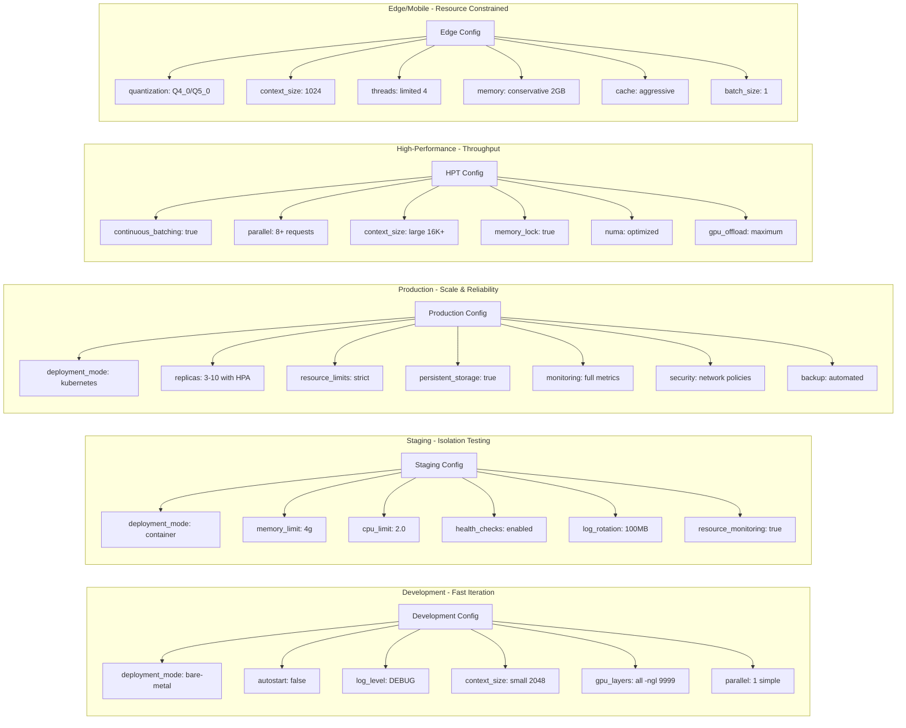

### Configuration File Examples

#### Multi-Scenario Setup (`~/.config/llamacpp/config.yaml`)
```yaml
default:
  llama_server_path: /opt/homebrew/bin/llama-server
  log_rotation_size: 100MB
  health_check_timeout: 10

models:
  # Bare-metal for development
  dev-small:
    model_path: ~/llms/small-model.gguf
    host: 127.0.0.1
    port: 8081
    deployment_mode: bare-metal
    autostart: true
    extra_args: "-c 4096 -ngl 9999"

  # Container for staging
  staging-model:
    model_path: ~/llms/staging-model.gguf
    port: 8082
    deployment_mode: container
    container:
      memory: 4g
      cpus: 2.0
      registry: staging-registry.com

  # Kubernetes for production
  prod-model:
    model_path: /models/prod-model.gguf
    port: 8080
    deployment_mode: kubernetes
    kubernetes:
      namespace: llamacpp-prod
      context: prod-cluster
      replicas:
        initial: 3
        min: 2
        max: 10
      image:
        registry: prod-registry.com
        repository: llamacpp-models
        tag: v1.0.0
```

### Migration Between Scenarios

#### Bare-Metal → Container
```bash
# Update existing model to use containers
llamacpp-manager config update MODEL_NAME --deployment-mode container

# Build container image
llamacpp-manager container build MODEL_NAME

# Restart with new mode
llamacpp-manager restart MODEL_NAME
```

#### Container → Kubernetes
```bash
# Push container to registry
llamacpp-manager container build MODEL_NAME --push

# Update deployment mode
llamacpp-manager config update MODEL_NAME \
  --deployment-mode kubernetes \
  --k8s-namespace prod \
  --k8s-replicas 3

# Deploy to cluster
llamacpp-manager restart MODEL_NAME
```

### MCP Server Integration

```bash
# Start MCP server for external integrations
llamacpp-mcp-server

# Available MCP tools:
# - list_models
# - start_model
# - stop_model
# - model_status
# - query_completion
# - query_chat
# - add_model
# - remove_model
```

### Automation Scripts

#### Health Check Script
```bash
#!/bin/bash
# health-check.sh - Monitor all models

models=$(llamacpp-manager config list --json | jq -r '.[].name')

for model in $models; do
    if ! llamacpp-manager query complete "$model" "test" --max-tokens 1 >/dev/null 2>&1; then
        echo "⚠️  Model $model is unhealthy, restarting..."
        llamacpp-manager restart "$model"
    else
        echo "✅ Model $model is healthy"
    fi
done
```

#### Auto-Deployment Script
```bash
#!/bin/bash
# deploy.sh - Deploy all models based on environment

ENV=${1:-dev}

case $ENV in
    dev)
        llamacpp-manager start all --mode bare-metal
        ;;
    staging)
        llamacpp-manager start all --mode container
        ;;
    prod)
        llamacpp-manager start all --mode kubernetes
        ;;
esac
```

---

This manual covers all three deployment scenarios with practical examples and troubleshooting guidance. Choose the scenario that best fits your needs and follow the step-by-step instructions for your specific use case.